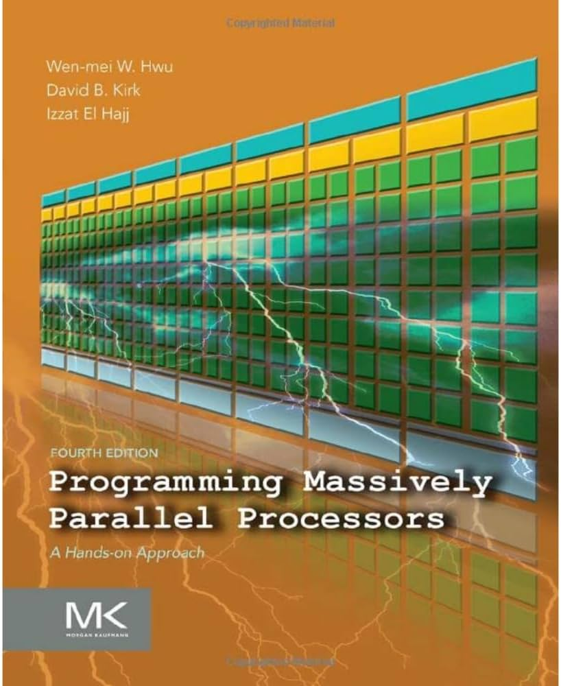

# 🚀 Programming Massively Parallel Processors: Complete solutions



Ever found yourself stuck on PMPP exercises? We've been there too. This repository provides **complete, thoughtfully crafted solutions** to all exercises in the renowned "Programming Massively Parallel Processors" (4th Edition) by Kirk, Hwu, and El Hajj.

## What You'll Find Here

For each chapter, we provide:
- ✅ **Comprehensive solutions** with detailed explanations
- 💡 **Chain-of-thought reasoning** that walks you through our problem-solving process
- 🧪 **Working code examples** that you can run and experiment with
- 📚 **Implementation details** with clear instructions

## Chapter Solutions

- [Chapter 2](chapter-02/README.md) - CUDA Programming Model
- [Chapter 3](chapter-03/README.md) - CUDA Thread Organization
- [Chapter 4](chapter-04/README.md) - Kernel-Based Parallel Programming
- [Chapter 5](chapter-05/README.md) - CUDA Memory Architecture
- [Chapter 6](chapter-06/README.md) - Performance Considerations
- [Chapter 7](chapter-07/README.md) - Parallel Patterns: Convolution
- [Chapter 8](chapter-08/README.md) - Parallel Patterns: Prefix Sum
- [Chapter 9](chapter-09/README.md) - Parallel Patterns: Stencil & Recurrence
- [Chapter 10](chapter-10/README.md) - Parallel Patterns: Reduction
- [Chapter 11](chapter-11/README.md) - Parallel Patterns: Sorting
- [Chapter 12](chapter-12/README.md) - Parallel Patterns: Histogram
- [Chapter 13](chapter-13/README.md) - Parallel Patterns: SpMV
- [Chapter 14](chapter-14/README.md) - Application Case Study: SIFT
- [Chapter 15](chapter-15/README.md) - Application Case Study: FFT
- [Chapter 16](chapter-16/README.md) - Application Case Study: Graph Traversal
- [Chapter 17](chapter-17/README.md) - Application Case Study: Deep Learning
- [Chapter 18](chapter-18/README.md) - Programming CPUs, GPUs, and FPGAs
- [Chapter 20](chapter-20/README.md) - Programming with OpenCL
- [Chapter 21](chapter-21/README.md) - Parallel Programming with Thrust

## Running the code

The repository requires:
- NVIDIA GPU hardware
- CUDA toolkit with NVCC compiler

### Python Environment Setup

```bash
conda create -n pmpp python=3.11

conda activate pmpp

pip install -r requirements.txt
```

For C/CUDA examples, we provide Makefiles with compilation instructions in each chapter's directory.

## Contributing

Found an error? We welcome your contributions!

Together, we can build the most accurate PMPP solutions resource available!
