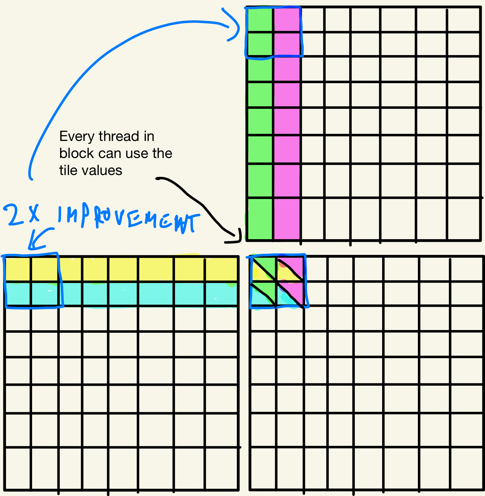
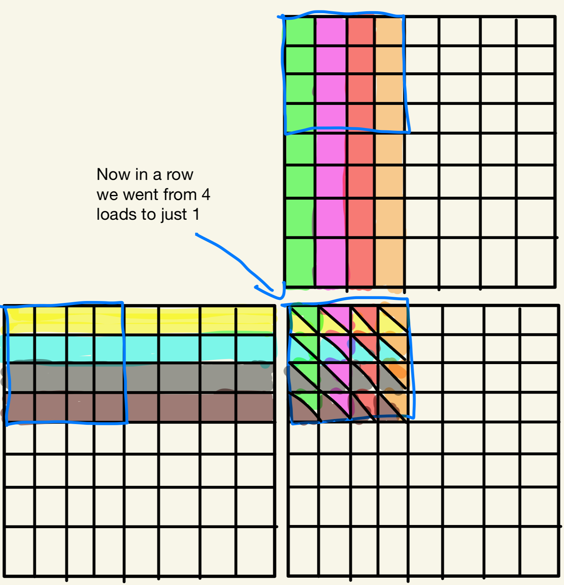

# 第五章：分块矩阵乘法与共享内存

## 代码

本章实现了分块矩阵乘法算法（Tiled Matrix Multiplication）。运行实验：

```bash
cd code
nvcc -o matrix_mul matrix_mul_benchmark.cu
./matrix_mul
```

我们进行了一系列速度对比基准测试，以及数值一致性验证。

```bash
Average time for matrixMulTiling: 53.6356 ms
Average time for matrixMul: 57.2734 ms
Outputs are approximately the same
```

## 练习

### 习题 1

**考虑矩阵加法。能否使用共享内存来降低全局内存带宽消耗？提示：分析每个线程访问的元素，看线程之间是否存在共用数据。**

在矩阵加法中，线程之间不存在数据复用。线程 `(0, 0)` 加载 `M[0, 0]` 和 `N[0, 0]`，线程 `(124, 12)` 加载 `M[124, 12]` 和 `N[124, 12]`，以此类推。由于同一块内的线程之间没有数据复用，因此无法通过共享内存来降低内存带宽消耗。

### 习题 2

**为 8×8 矩阵乘法分别画出 2×2 分块和 4×4 分块时对应图 5.7 的示意图。验证全局内存带宽的降低确实与分块维度大小成正比。**





### 习题 3

**如果忘记在图 5.9 的内核中使用一个或两个 `__syncthreads()`，会发生什么错误？**

如果忘记第一个 `__syncthreads()`，我们会在 `Mds` 和 `Nds` 矩阵中的数据尚未全部就绪时就开始读取，可能读到未初始化的内存，导致 `PValue` 累加了错误的值。

如果忘记第二个 `__syncthreads()`，我们可能在某些线程还在读取 `Mds` 和 `Nds` 时，另一些线程已经开始覆写这些共享内存，导致读取到错误数据。

如果两个都忘记，则以上两种错误同时发生。

### 习题 4

**假设寄存器和共享内存的容量都不是问题，请给出一个使用共享内存而非寄存器来保存从全局内存读取的值的重要理由。**

共享内存的核心优势在于：它可以被同一块（block）内的**任意线程**访问。这意味着我们只需从全局内存加载一次数据，存入共享内存后，块内所有线程都可以复用这个值。而寄存器是线程私有的，其他线程无法访问某个线程的寄存器中的值。

### 习题 5

**对于分块矩阵乘法内核，若使用 32×32 的分块，输入矩阵 M 和 N 的内存带宽使用量降低了多少？**

假设 `M` 的大小为 `m×n`，`N` 的大小为 `n×o`。

对于矩阵 `P` 的第 0 行，原来需要为该行每个元素都从全局内存加载整行 M（共 `n` 次加载）。使用分块后，我们只需将数据加载一次到分块 `Mds` 中，全局内存加载次数从 `n` 降至 `n/32`，降低了 **32 倍**。对 `M` 的每一行和 `N` 的每一列都是如此。

### 习题 6

**假设一个 CUDA 内核以 1000 个线程块启动，每块有 512 个线程。若在内核中声明了一个局部变量，该变量在整个执行生命周期内会创建多少个副本？**

网格中共有 `1000 × 512 = 512,000` 个线程。局部变量为每个线程各创建一份，因此共创建 **512,000** 个副本。

### 习题 7

**在上一题中，若变量声明为共享内存变量，会创建多少个副本？**

共享内存变量每个块创建一份，共有 1000 个块，因此创建 **1000** 个副本。

### 习题 8

**对两个 N×N 的输入矩阵进行矩阵乘法，每个输入矩阵中的元素从全局内存被请求多少次？**

**a. 无分块时？**

对于结果矩阵 `P` 第一行的每个元素，都需要加载 `M` 的整个第一行。因此 `M` 第一行的每个元素被加载 `N` 次。对每一行都如此，`N` 的每一列同理。无分块时，每个输入元素被加载 **N 次**。

**b. 使用 T×T 分块时？**

使用分块后，每个值从全局内存加载一次，存入共享内存后被块内 T 个线程复用。因此每个元素被加载 **N/T 次**，比无分块时减少了 T 倍。

### 习题 9

**一个内核每个线程执行 36 次浮点运算，访问 7 次 32 位全局内存。对于以下设备参数，判断该内核是计算密集型还是内存密集型。**

**a. 峰值 FLOPS=200 GFLOPS，峰值内存带宽=100 GB/s**

- 计算上限：`200×10⁹ / 36 ≈ 5.55×10⁹` 次内核执行/秒
- 内存上限：`100×10⁹ / (7×4) ≈ 3.57×10⁹` 次内核执行/秒

内存上限更严苛，该内核是**内存密集型**。

**b. 峰值 FLOPS=300 GFLOPS，峰值内存带宽=250 GB/s**

- 计算上限：`300×10⁹ / 36 ≈ 8.33×10⁹` 次内核执行/秒
- 内存上限：`250×10⁹ / (7×4) ≈ 8.93×10⁹` 次内核执行/秒

计算上限更严苛，该内核是**计算密集型**。

### 习题 10

**一位 CUDA 新手编写了一个对矩阵中每个分块进行转置的内核。分块大小为 BLOCK_WIDTH×BLOCK_WIDTH，矩阵 A 的两个维度均为 BLOCK_WIDTH 的整数倍。**

```cpp
dim3 blockDim(BLOCK_WIDTH, BLOCK_WIDTH);
dim3 gridDim(A_width/blockDim.x, A_height/blockDim.y);
BlockTranspose<<<gridDim, blockDim>>>(A, A_width, A_height);

__global__ void BlockTranspose(float* A_elements, int A_width, int A_height)
{
    __shared__ float blockA[BLOCK_WIDTH][BLOCK_WIDTH];

    int baseIdx = blockIdx.x * BLOCK_SIZE + threadIdx.x;
    baseIdx += (blockIdx.y * BLOCK_SIZE + threadIdx.y) * A_width;

    blockA[threadIdx.y][threadIdx.x] = A_elements[baseIdx];

    A_elements[baseIdx] = blockA[threadIdx.x][threadIdx.y];
}
```

**a. 在 BLOCK_SIZE 的可能取值范围内，哪些值能让内核正确执行？**

只有 `BLOCK_SIZE=1` 时能正确执行，因为此时块内只有一个线程，不需要同步，转置操作是平凡的。

**b. 如果代码不能对所有 BLOCK_SIZE 值正确执行，根本原因是什么？如何修复？**

根本原因是第 10 行之后缺少 `__syncthreads()`。没有同步，线程在读取 `blockA[threadIdx.x][threadIdx.y]`（第 11 行）时，其他线程可能还没有完成对 `blockA` 的写入，导致读取到错误数据。

修复方案：在写入和读取之间加入 `__syncthreads()`：

```cpp
blockA[threadIdx.y][threadIdx.x] = A_elements[baseIdx];
__syncthreads();  // 等待所有线程完成写入
A_elements[baseIdx] = blockA[threadIdx.x][threadIdx.y];
```

### 习题 11

**考虑以下 CUDA 内核：**

```cpp
__global__ void foo_kernel(float* a, float* b) {
    unsigned int i = blockIdx.x*blockDim.x + threadIdx.x;
    float x[4];
    __shared__ float y_s;
    __shared__ float b_s[128];
    for(unsigned int j = 0; j < 4; ++j) {
        x[j] = a[j*blockDim.x*gridDim.x + i];
    }
    if(threadIdx.x == 0) {
        y_s = 7.4f;
    }
    b_s[threadIdx.x] = b[i];
    __syncthreads();
    b[i] = 2.5f*x[0] + 3.7f*x[1] + 6.3f*x[2] + 8.5f*x[3]
            + y_s*b_s[threadIdx.x] + b_s[(threadIdx.x + 3)%128];
}
void foo(int* a_d, int* b_d) {
    unsigned int N = 1024;
    foo_kernel <<< (N + 128 - 1)/128, 128 >>>(a_d, b_d);
}
```

**a. 变量 `i` 有多少个版本？**

网格中共有 `⌈1024/128⌉ × 128 = 8 × 128 = 1024` 个线程，每个线程一份，共 **1024** 个版本。

**b. 数组 `x[]` 有多少个版本？**

同上，每个线程一份，共 **1024** 个版本。

**c. 变量 `y_s` 有多少个版本？**

`y_s` 是共享内存变量，每个块一份，共 **8** 个版本。

**d. 数组 `b_s[]` 有多少个版本？**

同 c，共 **8** 个版本。

**e. 每个块使用多少字节的共享内存？**

- `y_s`：1 个 float = **4 字节**
- `b_s[128]`：128 个 float = **512 字节**
- 合计：**516 字节**

**f. 内核的浮点运算与全局内存访问比（OP/B）是多少？**

全局内存加载：
- 第 7 行：从 `a` 加载 4 次
- 第 12 行：从 `b` 加载 1 次
- 共 5 次加载，每次 4 字节 = **20 字节**

浮点运算（第 14 行）：`2.5f*x[0]`、`3.7f*x[1]`、`6.3f*x[2]`、`8.5f*x[3]`、`y_s*b_s[...]` 共 5 次乘法，加上 5 次加法，共 **10 次运算**

比值：`10 ops / 20 bytes = **0.5 OP/B**`

### 习题 12

**考虑一个具有以下硬件限制的 GPU：2048 线程/SM，32 块/SM，65536 寄存器/SM，96 KB 共享内存/SM。对于以下内核特性，判断是否能达到完全占用率（full occupancy）。**

**a. 64 线程/块，27 寄存器/线程，4 KB 共享内存/块**

- 线程限制：`32 块 × 64 线程 = 2048 线程` ✓
- 寄存器限制：`2048 × 27 = 55296 < 65536` ✓
- 共享内存限制：`32 块 × 4 KB = 128 KB > 96 KB` ✗

共享内存是瓶颈，最多只能运行 `96/4 = 24` 个块，占用率为 `24×64/2048 = 75%`。

**b. 256 线程/块，31 寄存器/线程，8 KB 共享内存/块**

- 线程限制：`2048/256 = 8 块`，`8×256 = 2048 线程` ✓
- 寄存器限制：`2048 × 31 = 63488 < 65536` ✓
- 共享内存限制：`8 × 8 KB = 64 KB < 96 KB` ✓

所有限制均满足，可达到 **100% 占用率**。
