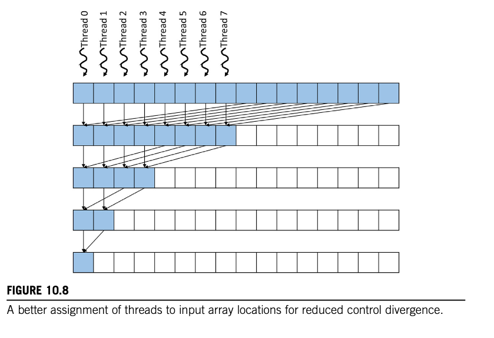
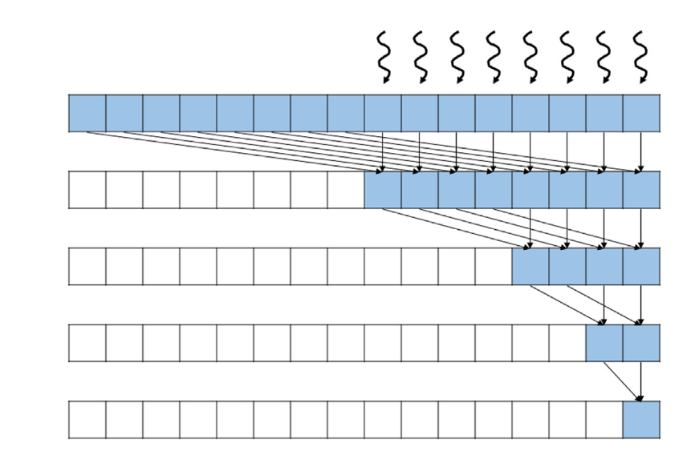
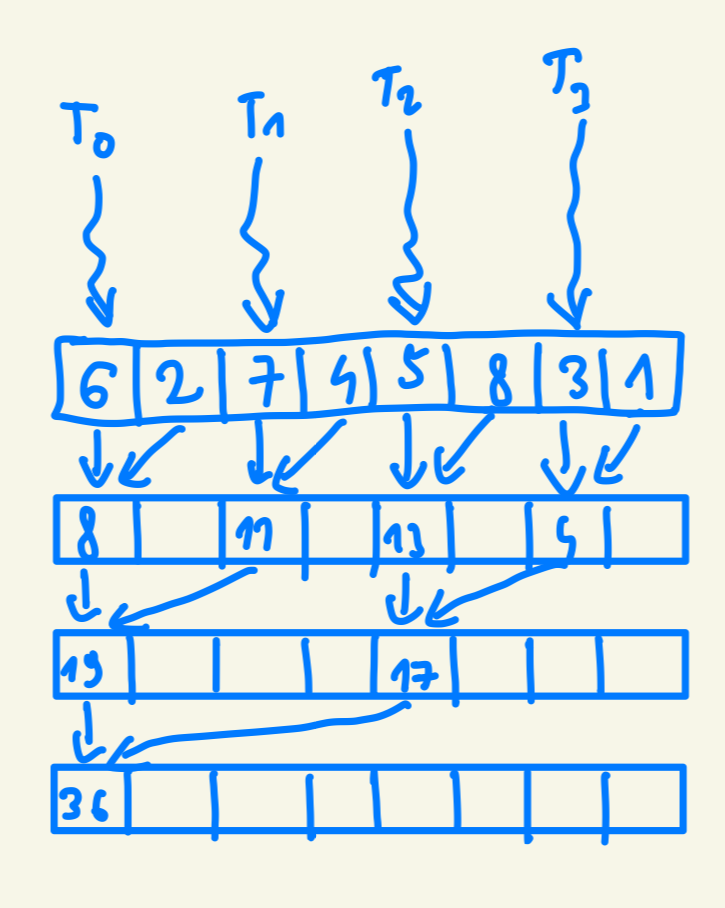
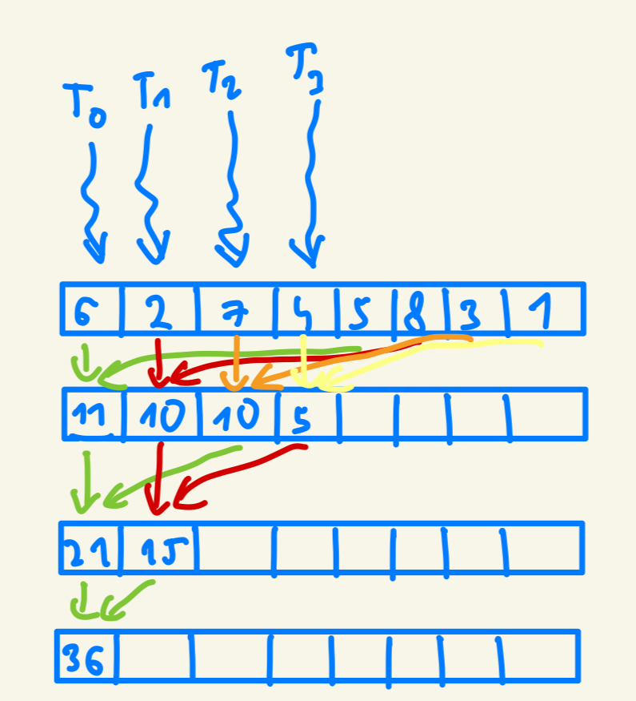

# 第十章：并行归约（Parallel Reduction）

## 代码

本章实现、基准测试并验证了所有列出的归约内核。为方便起见，我们将实现拆分为两个文件：一个仅处理 `2048` 个元素的内核 [reduction_sum_2048.cu](code/reduction_sum_2048.cu)，以及处理任意长度数组的内核 [reduction_sum.cu](code/reduction_sum.cu)。

```bash
cd code
```

运行 `reduction_sum_2048.cu`：

```bash
nvcc reduction_sum_2048.cu reduction_common.cu -o reduction_sum_2048

reduction_sum_2048
```

```bash
nvcc reduction_sum.cu reduction_common.cu -o reduction_sum

reduction_sum
```

此外，为了完成**习题 4**，我们实现了一个求最大值的归约内核，见 [reduction_max.cu](code/reduction_max.cu)。

```bash
nvcc reduction_max.cu -o reduction_max

reduction_max
```

**注意：基准测试并非 100% 精确，因为 `hostToDevice` 拷贝包含在计时范围内；这是为了方便，但我们承认这并不完全正确。**

## 习题

### 习题 1

**对于 Fig. 10.6 的朴素归约内核，若元素数量为 1024，warp 大小为 32，第五次迭代时有多少个 warp 存在控制分歧？**

```cpp
__global__ void simple_sum_reduction_kernel(float* input, float* output){
    unsigned int i = 2 * threadIdx.x;

    for (unsigned int stride = 1; stride <= blockDim.x; stride *= 2){
        if (threadIdx.x % stride == 0){
            input[i] += input[i + stride];
        }
        __syncthreads();
    }

    if (threadIdx.x == 0)
        *output = input[0];
}
```

第一次迭代中每个线程处理两个元素，因此 1024 个元素需要 `1024/2 = 512` 个线程。

warp 大小为 32，共有 `512/32 = 16` 个 warp。

- 迭代 1：stride = 1
- 迭代 2：stride = 2
- 迭代 3：stride = 4
- 迭代 4：stride = 8
- 迭代 5：stride = 16

只有满足 `threadIdx.x % stride == 0`（第 04 行）的线程才会执行。因此在第五次迭代中，执行的线程为 `0, 16, 32, 48, 64, 80, 96, 112, 128, 144, 160, 176, 192, 208, 224, 240, 256, 272, 288, 304, 320, 336, 352, 368, 384, 400, 416, 432, 448, 464, 480, 496`。每个 warp 中有两个线程被执行（例如 warp 0 中的线程 0 和 16，warp 15 中的线程 480 和 496），这意味着所有 16 个 warp 都处于活跃状态且存在控制分歧。

答案是 **16** 个 warp 存在控制分歧。

### 习题 2

**对于 Fig. 10.9 的收敛型归约内核，若元素数量为 1024，warp 大小为 32，第五次迭代时有多少个 warp 存在控制分歧？**

```cpp
__global__ void ConvergentSumReductionKernel(float* input, float* output) {
    unsigned int i = threadIdx.x;
    for (unsigned int stride = blockDim.x; stride >= 1; stride /= 2) {
        if (threadIdx.x < stride) {
            input[i] += input[i + stride];
        }
        __syncthreads();
    }
    if(threadIdx.x == 0) {
        *output = input[0];
    }
}
```

与习题 1 相同，共有 `512` 个线程和 `16` 个 warp。

只有满足 `threadIdx.x < stride` 的线程才会执行：

- 迭代 1：stride = 512
- 迭代 2：stride = 256
- 迭代 3：stride = 128
- 迭代 4：stride = 64
- 迭代 5：stride = 32



该内核的设计使得只有最左边的 `stride` 个线程被执行（见上图）。在第五次迭代中，只有最左边的 32 个线程被执行。由于 warp 大小为 32，恰好填满一个完整的 warp，因此不存在控制分歧。其余 warp 完全不活跃，也不存在分歧。

答案是：**没有** warp 存在控制分歧。

### 习题 3

**修改 Fig. 10.9 的内核，使其使用下图所示的反向访问模式。**



原始内核：
```cpp
__global__ void ConvergentSumReductionKernel(float* input, float* output) {
    unsigned int i = threadIdx.x;
    for (unsigned int stride = blockDim.x; stride >= 1; stride /= 2) {
        if (threadIdx.x < stride) {
            input[i] += input[i + stride];
        }
        __syncthreads();
    }
    if(threadIdx.x == 0) {
        *output = input[0];
    }
}
```

修改后：

```cpp
__global__ void covergent_sum_reduction_kernel_reversed(float* input, float* output){
    unsigned int i = threadIdx.x + blockDim.x;
    for (unsigned int stride = blockDim.x; stride >= 1; stride /= 2){
        // stride 迭代方式不变，但用于索引前一个要取的输入
        if (blockDim.x - threadIdx.x <= stride){
            input[i] += input[i - stride];
        }
        __syncthreads();
    }
    // 从最后一个输入位置取结果
    if (threadIdx.x == blockDim.x-1){
        *output = input[i];
    }
}
```

`covergent_sum_reduction_kernel_reversed` 内核的实现和测试见 [reduction_sum_2048.cu](code/reduction_sum_2048.cu)。

### 习题 4

**修改 Fig. 10.15 的内核，将求和归约改为求最大值归约。**

```cpp
__global__ void CoarsenedMaxReductionKernel(float* input, float* output) {
    __shared__ float input_s[BLOCK_DIM];
    unsigned int segment = COARSE_FACTOR*2*blockDim.x*blockIdx.x;
    unsigned int i = segment + threadIdx.x;
    unsigned int t = threadIdx.x;
    float maximum_value = input[i];
    for(unsigned int tile = 1; tile < COARSE_FACTOR*2; ++tile) {
        maximum_value = fmax(maximum_value, input[i + tile*BLOCK_DIM]);
    }
    input_s[t] = maximum_value;

    for (unsigned int stride = blockDim.x/2; stride >= 1; stride /= 2){
        __syncthreads();
        if (t < stride) {
            input_s[t] = fmax(input_s[t], input_s[t + stride]);
        }
    }
    if (t == 0) {
        atomicExch(output, fmax(*output, input_s[0]));
    }
}
```

`CoarsenedMaxReductionKernel` 内核的实现和测试见 [reduction_max.cu](code/reduction_max.cu)。

### 习题 5

**修改 Fig. 10.15 的内核，使其支持任意长度的输入（不一定是 `COARSE_FACTOR*2*blockDim.x` 的整数倍）。向内核添加一个额外参数 N 表示输入长度。**

```cpp
__global__ void coarsed_sum_reduction_kernel(float* input, float* output, int length){
    __shared__ float input_s[BLOCK_DIM];
    unsigned int segment = COARSE_FACTOR*2*blockDim.x*blockIdx.x;
    unsigned int i = segment + threadIdx.x;
    unsigned int t = threadIdx.x;
    
    float sum = 0.0f;
    // 仅当 i 在数组范围内时执行，否则 sum=0
    if (i < length){
        sum = input[i];
    
        for(unsigned int tile = 1; tile < COARSE_FACTOR*2; ++tile) {
            // 仅累加实际在数组范围内的元素
            if (i + tile*BLOCK_DIM < length) {
                sum += input[i + tile*BLOCK_DIM];
            }
        }
    }

    input_s[t] = sum;
    
    for (unsigned int stride = blockDim.x/2; stride >= 1; stride /= 2){
        __syncthreads();
        if (t < stride) {
            input_s[t] += input_s[t + stride];
        }
    }
    if (t == 0) {
        atomicAdd(output, input_s[0]);
    }
}
```

`coarsed_sum_reduction_kernel` 内核的实现和测试见 [reduction_sum.cu](code/reduction_sum.cu)。

### 习题 6

**假设对以下输入数组执行并行归约：**

`[6, 2, 7, 4, 5, 8, 3, 1]`

**展示每次迭代后数组内容的变化：**

**a. 使用 Fig. 10.6 的未优化内核。**



**b. 使用 Fig. 10.9 的针对合并访存和分歧优化的内核。**


