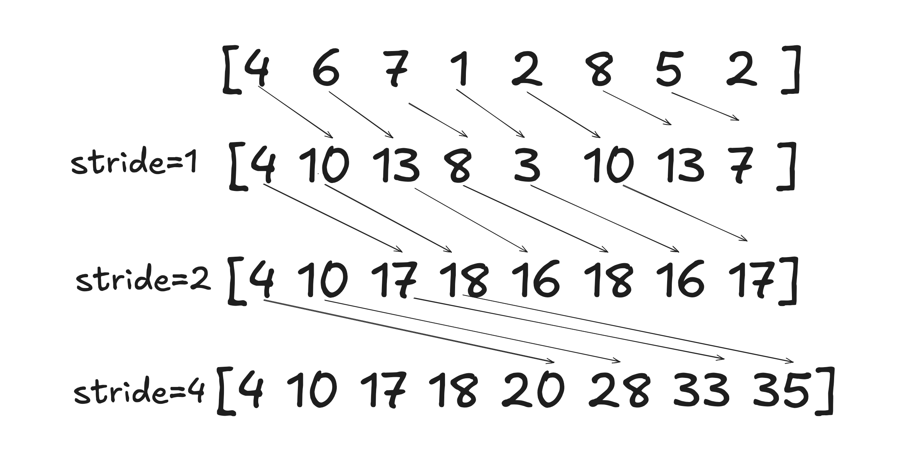
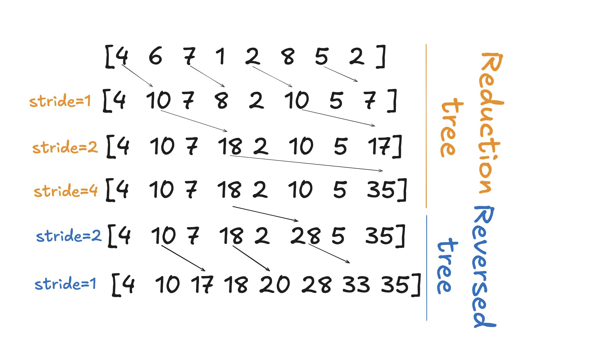
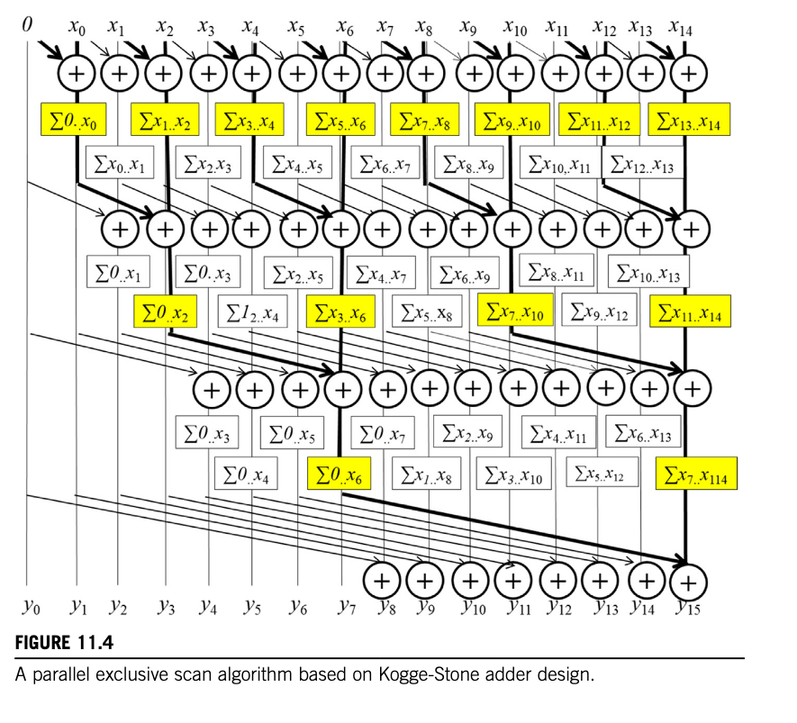

# 第十一章 前缀扫描（Prefix Scan）

## 代码

我们实现了本章描述的所有内核，包括：

- Kogge-Stone 扫描
- Kogge-Stone 双缓冲扫描
- Brent-Kung 扫描
- 三阶段扫描（Three-phase scan）

以上实现位于 [scan.cu](code/scan.cu)。运行方式：

```bash
nvcc scan.cu -o scan
./scan
```

我们还实现了分层内核（hierarchical kernel），能够处理任意长度的数组，并与传统的顺序扫描内核进行了基准测试。此外，我们还实现了一个具有多米诺式块间同步机制的内核。实现代码位于 [hierarchical_scan.cu](code/hierarchical_scan.cu)。

运行方式：

```bash
nvcc hierarchical_scan.cu -o hierarchical_scan
./hierarchical_scan
```

输出示例：

```bash
Benchmarking Scan Operations
----------------------------
Size       Sequential(ms)  Hierarchical(ms) Domino(ms)      Speedup-H  Speedup-D  Match   
16384      0.002           0.135           0.135           0.01       0.01       ✓✓
65536      0.088           0.196           0.220           0.45       0.40       ✓✓
262144     0.790           0.521           0.589           1.52       1.34       ✓✓
1048576    3.537           1.582           2.114           2.24       1.67       ✓✓
```

## 习题

### 习题 1
**考虑以下数组：[4 6 7 1 2 8 5 2]。使用 Kogge-Stone 算法对该数组执行并行 inclusive 前缀扫描。报告每一步后数组的中间状态。**



Kogge-Stone 算法的核心思想是：每次迭代中，stride 从 1 开始翻倍，每个位置 `i >= stride` 的元素都加上位置 `i - stride` 的元素。

初始数组：`[4, 6, 7, 1, 2, 8, 5, 2]`

**stride = 1：**
- 位置 1: 6 + 4 = 10
- 位置 2: 7 + 6 = 13
- 位置 3: 1 + 7 = 8
- 位置 4: 2 + 1 = 3
- 位置 5: 8 + 2 = 10
- 位置 6: 5 + 8 = 13
- 位置 7: 2 + 5 = 7

结果：`[4, 10, 13, 8, 3, 10, 13, 7]`

**stride = 2：**
- 位置 2: 13 + 4 = 17
- 位置 3: 8 + 10 = 18
- 位置 4: 3 + 13 = 16
- 位置 5: 10 + 8 = 18
- 位置 6: 13 + 3 = 16
- 位置 7: 7 + 10 = 17

结果：`[4, 10, 17, 18, 16, 18, 16, 17]`

**stride = 4：**
- 位置 4: 16 + 4 = 20
- 位置 5: 18 + 10 = 28
- 位置 6: 16 + 17 = 33
- 位置 7: 17 + 18 = 35

最终结果：`[4, 10, 17, 18, 20, 28, 33, 35]`

### 习题 2
**修改 Fig. 11.3 中的 Kogge-Stone 并行扫描内核，使用双缓冲代替第二次 `__syncthreads()` 调用来克服 write-after-read 竞争条件。**

我们在 [scan.cu](code/scan.cu) 中实现并测试了该内核。内核代码如下：

```cpp
__global__ void kogge_stone_scan_kernel_with_double_buffering(float *X, float *Y, unsigned int N){
    extern __shared__ float shared_mem[];
    float* buffer1 = shared_mem;
    float* buffer2 = &shared_mem[N];

    unsigned int tid = threadIdx.x;

    float *src_buffer = buffer1;
    float *trg_buffer = buffer2;

    if (tid < N){
        src_buffer[tid] = X[tid];
    }
    else{
        src_buffer[tid] = 0.0;
    }
    for (unsigned int stride = 1; stride < blockDim.x; stride *= 2){
        __syncthreads();
        // 不需要两次 __syncthreads()
        if (tid >= stride) {
            trg_buffer[tid] = src_buffer[tid] + src_buffer[tid - stride];
        } else {
            trg_buffer[tid] = src_buffer[tid];
        }
        
        float* temp;
        temp = src_buffer;
        src_buffer = trg_buffer;
        trg_buffer = temp;
    }

    if (tid < N){
        Y[tid] = src_buffer[tid];
    }
}
```

关键思想：通过交替使用两块共享内存（shared memory），读操作始终从 `src_buffer` 读取，写操作始终写入 `trg_buffer`，从而避免了同一块内存上的 write-after-read 竞争，只需要一次 `__syncthreads()` 即可。

### 习题 3
**分析 Fig. 11.3 中的 Kogge-Stone 并行扫描内核。证明控制分歧（control divergence）仅发生在每个 block 的第一个 warp 中，且仅在 stride 值不超过 warp 大小一半时发生。即对于 warp 大小 32，控制分歧将在 stride 值为 1、2、4、8 和 16 的 5 次迭代中发生。**

```cpp
01  __global__ void Kogge_Stone_scan_kernel(float *X, float *Y, unsigned int N){
02      shared float XY[SECTION_SIZE];
03      unsigned int i = blockIdx.x*blockDim.x + threadIdx.x;
04      if(i < N) {
05          XY[threadIdx.x] = X[i];
06      } else {
07          XY[threadIdx.x] = 0.0f;
08      }
09      for(unsigned int stride = 1; stride < blockDim.x; stride *= 2) {
10          syncthreads();
11          float temp;
12          if(threadIdx.x >= stride)
13              temp = XY[threadIdx.x] + XY[threadIdx.x-stride];
14          syncthreads();
15          if(threadIdx.x >= stride)
16              XY[threadIdx.x] = temp;
17      }
18      if(i < N) {
19          Y[i] = XY[threadIdx.x];
20      }
21  }
```

逐步分析：

**stride = 1：** 执行条件为 `threadIdx.x >= 1`，即除了线程 0 之外的所有线程都会执行。这意味着只有 warp 0（覆盖线程 `[0, 31]`）存在控制分歧。其他所有 warp（`[32, 47]`, `[48, 79]`, ... `[991, 1023]`）中的所有线程都会执行第 13 行和第 16 行指令。

**stride = 2：** 执行条件为 `threadIdx.x >= 2`，即线程 0 和线程 1 不执行。同样只有 warp 0 存在控制分歧。

**stride = 4：** 执行条件为 `threadIdx.x >= 4`，线程 0-3 不执行。仍然只有 warp 0 存在控制分歧。

**stride = 8：** 执行条件为 `threadIdx.x >= 8`，线程 0-7 不执行。只有 warp 0 存在控制分歧。

**stride = 16：** 执行条件为 `threadIdx.x >= 16`，线程 0-15 不执行。只有 warp 0 存在控制分歧。

**stride = 32：** 执行条件为 `threadIdx.x >= 32`，warp 0 中的所有线程（`[0, 31]`）都不执行——因此没有控制分歧。warp 1 的第一个线程索引是 32，该 warp 中所有线程都会执行。后续 warp 同理，不存在控制分歧。

**stride = 64** 及更大值同理——前面的 warp 被完全跳过，其余 warp 完全执行，不存在控制分歧。

因此，只有前 5 次迭代（stride = 1, 2, 4, 8, 16）会产生控制分歧。

### 习题 4
**对于基于归约树的 Kogge-Stone 扫描内核，假设有 2048 个元素。以下哪个选项最接近将执行的加法操作数？**

在 Kogge-Stone 算法中，每次迭代中每个活跃线程执行一次加法操作（第 13 行）。我们需要计算整个执行过程中活跃线程的总数。

本章中估算操作数的公式为 `N*log2(N) - (N - 1) = 2048 * 11 - (2048-1) = 20481`。

由于 2048 个元素超过了单个 block 的最大线程数（1024），需要 2 个 block，每个 block 1024 个线程。

对每个 block 分析活跃线程数：

| stride | 活跃线程数 |
|--------|-----------|
| 1      | 1023      |
| 2      | 1022      |
| 4      | 1020      |
| 8      | 1016      |
| 16     | 1008      |
| 32     | 992       |
| 64     | 960       |
| 128    | 896       |
| 256    | 768       |
| 512    | 512       |
| 1024   | 0（无线程满足 threadIdx.x >= 1024）|

每个 block 总计：`1023 + 1022 + 1020 + 1016 + 1008 + 992 + 960 + 896 + 768 + 512 = 9217` 次操作。

两个 block 合计：`9217 × 2 = 18434` 次操作。加上块间传播的 1024 次操作，总计约 `19458` 次操作。

这与理论值 20481 略有差异，原因在于实际需要将计算拆分到两个 block 中。如果数组恰好是 1024 个元素，则 `1024 * 10 - 1024 + 1 = 9217` 次操作，与我们对单个 block 的手动计算完全吻合。

### 习题 5
**考虑以下数组：[4 6 7 1 2 8 5 2]。使用 Brent-Kung 算法对该数组执行并行 inclusive 前缀扫描。报告每一步后数组的中间状态。**



Brent-Kung 算法分为两个阶段：归约树（up-sweep）和反向树（down-sweep）。

对应内核代码：

```cpp
__global__ void Brent_Kung_scan_kernel(float *X, float *Y, unsigned int N) {
    __shared__ float XY[SECTION_SIZE];
    unsigned int i = 2*blockIdx.x*blockDim.x + threadIdx.x;
    if(i < N) XY[threadIdx.x] = X[i];
    if(i + blockDim.x < N) XY[threadIdx.x + blockDim.x] = X[i + blockDim.x];
    for(unsigned int stride = 1; stride <= blockDim.x; stride *= 2) {
        __syncthreads();
        unsigned int index = (threadIdx.x + 1)*2*stride - 1;
        if(index < SECTION_SIZE) {
            XY[index] += XY[index - stride];
        }
    }
    for(int stride = SECTION_SIZE/4; stride > 0; stride /= 2) {
        __syncthreads();
        unsigned int index = (threadIdx.x + 1)*stride*2 - 1;
        if(index + stride < SECTION_SIZE) {
            XY[index + stride] += XY[index];
        }
    }
    __syncthreads();
    if(i < N) Y[i] = XY[threadIdx.x];
    if(i + blockDim.x < N) Y[i + blockDim.x] = XY[threadIdx.x + blockDim.x];
}
```

初始数组：`[4, 6, 7, 1, 2, 8, 5, 2]`，SECTION_SIZE = 8，blockDim.x = 4

**归约树阶段：**

stride = 1: index = (tid+1)*2 - 1
- tid=0: index=1, XY[1] += XY[0] → 6+4=10
- tid=1: index=3, XY[3] += XY[2] → 1+7=8
- tid=2: index=5, XY[5] += XY[4] → 8+2=10
- tid=3: index=7, XY[7] += XY[6] → 2+5=7

结果：`[4, 10, 7, 8, 2, 10, 5, 7]`

stride = 2: index = (tid+1)*4 - 1
- tid=0: index=3, XY[3] += XY[1] → 8+10=18
- tid=1: index=7, XY[7] += XY[5] → 7+10=17

结果：`[4, 10, 7, 18, 2, 10, 5, 17]`

stride = 4: index = (tid+1)*8 - 1
- tid=0: index=7, XY[7] += XY[3] → 17+18=35

结果：`[4, 10, 7, 18, 2, 10, 5, 35]`

**反向树阶段：**

stride = 2 (SECTION_SIZE/4 = 2): index = (tid+1)*4 - 1
- tid=0: index=3, index+stride=5, XY[5] += XY[3] → 10+18=28

结果：`[4, 10, 7, 18, 2, 28, 5, 35]`

stride = 1: index = (tid+1)*2 - 1
- tid=0: index=1, index+stride=2, XY[2] += XY[1] → 7+10=17
- tid=1: index=3, index+stride=4, XY[4] += XY[3] → 2+18=20
- tid=2: index=5, index+stride=6, XY[6] += XY[5] → 5+28=33

最终结果：`[4, 10, 17, 18, 20, 28, 33, 35]`

### 习题 6
**对于 Brent-Kung 扫描内核，假设有 2048 个元素。归约树阶段和反向归约树阶段分别执行多少次加法操作？**

Brent-Kung 算法中，每个线程初始处理两个元素，因此 2048 个元素只需 1024 个线程，即单个 block。

**归约树阶段：**

| stride | 活跃线程数 |
|--------|-----------|
| 1      | 1024      |
| 2      | 512       |
| 4      | 256       |
| 8      | 128       |
| 16     | 64        |
| 32     | 32        |
| 64     | 16        |
| 128    | 8         |
| 256    | 4         |
| 512    | 2         |
| 1024   | 1         |

归约树总计：`1024 + 512 + 256 + 128 + 64 + 32 + 16 + 8 + 4 + 2 + 1 = 2047` 次操作。

**反向树阶段：**

| stride | 活跃线程数 |
|--------|-----------|
| 512    | 1         |
| 256    | 4 (注)    |
| 128    | 7         |
| 64     | 15        |
| 32     | 31        |
| 16     | 63        |
| 8      | 127       |
| 4      | 254       |
| 2      | 509       |
| 1      | 1019      |

反向树总计：`1 + 4 + 7 + 15 + 31 + 63 + 127 + 254 + 509 + 1019 = 2030` 次操作。

两个阶段合计：`2047 + 2030 = 4077` 次操作。

本章 11.4 节中估算公式为 `2N - 2 - log2(N) = 2 * 2048 - 2 - log2(2048) = 4083`，与手动计算结果非常接近。

### 习题 7
**使用 Fig. 11.4 中的算法完成一个 exclusive scan 内核。**



### 习题 8
**完成 Fig. 11.9 中分层并行扫描算法的 host 代码和所有三个内核。**

实现代码位于 [hierarchical_scan.cu](code/hierarchical_scan.cu)。我们实现了两个版本：使用额外数组 `S` 存储 block 求和的版本，以及使用多米诺式块间同步机制的版本。后者代码如下：

```cpp
// 单内核多米诺式扫描实现
__global__ void hierarchical_kogge_stone_domino(
    float *X,          
    float *Y,          
    float *scan_value, 
    int *flags,        
    int *blockCounter, 
    unsigned int N     
) {
    extern __shared__ float buffer[];
    __shared__ unsigned int bid_s;
    __shared__ float previous_sum;
    
    const unsigned int tid = threadIdx.x;
    
    // 防止死锁：动态 block 索引分配
    if (tid == 0) {
        bid_s = atomicAdd(blockCounter, 1);
    }
    __syncthreads();
    
    const unsigned int bid = bid_s;
    const unsigned int gid = bid * blockDim.x + tid;

    // 阶段 1：使用 Kogge-Stone 进行 block 内扫描
    if (gid < N) {
        buffer[tid] = X[gid];
    } else {
        buffer[tid] = 0.0f;
    }

    // block 内 Kogge-Stone 扫描
    for (unsigned int stride = 1; stride < blockDim.x; stride *= 2) {
        __syncthreads();
        float temp = buffer[tid];
        if (tid >= stride) {
            temp += buffer[tid - stride];
        }
        __syncthreads();
        buffer[tid] = temp;
    }

    // 存储局部结果
    if (gid < N) {
        Y[gid] = buffer[tid];
    }

    // 获取当前 block 的局部总和
    const float local_sum = buffer[blockDim.x - 1];

    // 阶段 2：块间求和传播
    if (tid == 0) {
        if (bid > 0) {
            // 等待前一个 block 的标志
            while (atomicAdd(&flags[bid], 0) == 0) { }
            
            // 获取前一个 block 的累计和
            previous_sum = scan_value[bid];
            
            // 加上局部总和并传播
            const float total_sum = previous_sum + local_sum;
            scan_value[bid + 1] = total_sum;
            
            // 确保 scan_value 对其他 block 可见
            __threadfence();
            
            // 通知下一个 block
            atomicAdd(&flags[bid + 1], 1);
        } else {
            // 第一个 block 直接传播其总和
            scan_value[1] = local_sum;
            __threadfence();
            atomicAdd(&flags[1], 1);
        }
    }
    __syncthreads();

    // 阶段 3：将前面 block 的累计和加到局部结果
    if (bid > 0 && gid < N) {
        Y[gid] += previous_sum;
    }
}
```

关键设计要点：
- 使用 `atomicAdd(blockCounter, 1)` 动态分配 block 索引，防止 GPU 调度器乱序执行导致的死锁
- 使用 `flags` 数组和 `__threadfence()` 实现块间同步
- 每个 block 的线程 0 负责等待前一个 block 完成并传播累计和
