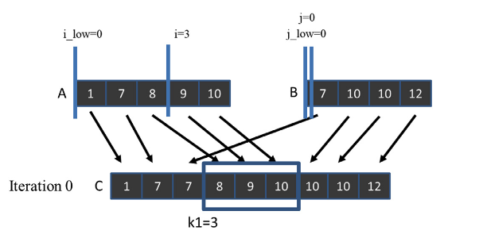

# 第十二章 归并排序（Merge Sort）

## 代码

本章实现了 `merge_sequential`（顺序归并）、`simple_merge_parallel_gpu`（基础并行归并）和 `merge_parallel_with_tiling_gpu`（分块并行归并）三种归并算法。运行基准测试：

```bash
nvcc merge_bench.cu -o merge_bench
./merge_bench
```

我们对两个任意长度的已排序数组进行归并基准测试。

## 核心概念

### 顺序归并（Sequential Merge）

顺序归并是最基础的归并操作：维护两个指针分别指向数组 A 和 B，每次比较两个指针所指元素，将较小的放入输出数组 C，并移动对应指针。

```cpp
__host__ __device__ void merge_sequential(float* A, int m, float* B, int n, float* C) {
    int i = 0, j = 0, k = 0;
    while (i < m && j < n) {
        if (A[i] <= B[j]) {
            C[k++] = A[i++];
        } else {
            C[k++] = B[j++];
        }
    }
    while (i < m) C[k++] = A[i++];
    while (j < n) C[k++] = B[j++];
}
```

### Co-rank 函数

Co-rank 是并行归并的核心工具。给定输出位置 k，co-rank 函数通过二分搜索确定：从数组 A 中取前 i 个元素、从数组 B 中取前 j = k - i 个元素，恰好能填满输出数组 C 的前 k 个位置。

```cpp
__host__ __device__ int co_rank(int k, float* A, int m, float* B, int n) {
    int i = min(k, m);
    int j = k - i;
    int i_low = max(0, k - n);
    int j_low = max(0, k - m);
    int delta;
    bool active = true;
    while (active) {
        if (i > 0 && j < n && A[i - 1] > B[j]) {
            delta = cdiv(i - i_low, 2);
            j_low = j;
            i -= delta;
            j += delta;
        } else if (j > 0 && i < m && B[j - 1] >= A[i]) {
            delta = cdiv(j - j_low, 2);
            i_low = i;
            i += delta;
            j -= delta;
        } else {
            active = false;
        }
    }
    return i;
}
```

### 基础并行归并（Basic Parallel Merge）

每个线程通过 co-rank 函数确定自己负责的输出范围 `[k_curr, k_next)`，然后计算对应的 A 和 B 子数组范围，最后调用顺序归并完成局部归并。

```cpp
__global__ void merge_basic_kernel(float* A, int m, float* B, int n, float* C) {
    int tid = blockIdx.x * blockDim.x + threadIdx.x;
    int elementsPerThread = cdiv((m + n), blockDim.x * gridDim.x);
    int k_curr = tid * elementsPerThread;
    int k_next = min((tid + 1) * elementsPerThread, m + n);
    int i_curr = co_rank(k_curr, A, m, B, n);
    int j_curr = k_curr - i_curr;
    int i_next = co_rank(k_next, A, m, B, n);
    int j_next = k_next - i_next;
    merge_sequential(&A[i_curr], i_next - i_curr, &B[j_curr], j_next - j_curr, &C[k_curr]);
}
```

### 分块并行归并（Tiled Parallel Merge）

分块归并利用共享内存（shared memory）减少全局内存访问：

1. 每个 block 先用 co-rank 确定自己负责的 C 子数组范围
2. 迭代地将 A 和 B 的 tile 加载到共享内存
3. 每个线程在共享内存上执行 co-rank 和顺序归并
4. 更新已消耗的 A、B 元素计数，进入下一轮迭代

```cpp
__global__ void merge_tiled_kernel(float* A, int m, float* B, int n, float* C) {
    extern __shared__ float shareAB[];
    float* A_S = shareAB;
    float* B_S = shareAB + TILE_SIZE;
    // ... block 级 co-rank 确定范围 ...
    while (counter < total_iteration) {
        // 加载 tile 到共享内存
        // 线程级 co-rank（在共享内存上）
        // 顺序归并
        // 更新消耗计数
    }
}
```

## 习题解答

### 习题 1

**假设需要归并两个列表 A=(1, 7, 8, 9, 10) 和 B=(7, 10, 10, 12)。C[8] 的 co-rank 值是多少？**

首先回顾 `co_rank` 函数的作用——用于推导子数组 A 和 B 的起始位置，使得从该位置开始的子数组能够归并到从 k 开始的子数组 C 中。

最终归并数组为：`[1, 7, 7, 8, 9, 10, 10, 12]`。

从 C[8] 开始的子数组只包含一个元素——来自数组 B 的 `12`。因此子数组 A 从索引 5 开始（不取任何元素），子数组 B 从索引 `k-i = 8-5 = 3` 开始，包含单个元素 `B[3] = 12`。

执行 `co_rank(8, A, 5, B, 4)`：

迭代 0：
```
i = min(k,m) = min(8,5) = 5
j = k - i = 8 - 5 = 3
i_low = max(0,k-n) = max(0,8-4) = 4
j_low = max(0,k-m) = max(0,8-5) = 3
```

第一个 if：`i>0✅ && j<n✅ && A[4] > B[3]❌`（10 > 12 为假）

第二个 if：`j>0 && i < m❌`（5 < 5 为假）

触发第三个分支，结束循环，返回 `i = 5`。与直觉分析一致。

### 习题 2

**完成图 12.6 中线程 2 的 co-rank 函数计算。**



线程 2 从 k=6 开始，需要计算 `co_rank(6, A, 5, B, 4)`。直觉上，子数组 `C[6:]` 不从数组 A 取任何元素，从数组 B 的索引 1 开始取三个元素。因此期望 co-rank 为 5。

逐步分析：
```
m = 5, n = 4
i = min(6,5) = 5
j = 6 - 5 = 1
i_low = max(0,6-4) = 2
j_low = max(0,6-5) = 1
```

第一个 if：`i>0✅ && j<n✅ && A[4] > B[1]❌`

第二个 if：`j>0 && i < m❌`

触发第三个分支，返回 `i = 5`，与直觉分析一致。

### 习题 3

**对于图 12.12 中加载 A 和 B tile 的 for 循环，添加 co-rank 函数调用，使得只加载当前 while 循环迭代中会被消耗的 A 和 B 元素。**

```cpp
while(counter < total_iteration){
    // 确定需要多少 A 元素（tileA），使得总共归并 tile_size 个元素
    // 剩余的 tileB 个元素来自 B
    int tileA = co_rank(tile_size,
                        A + A_curr + A_consumed, A_length - A_consumed,
                        B + B_curr + B_consumed, B_length - B_consumed);
    int tileB = tile_size - tileA;

    // 只加载需要的 A 元素到共享内存：i + threadIdx.x < tileA
    for(int i = 0; i < tileA; i += blockDim.x) {
        if (i + threadIdx.x < tileA) {
            A_S[i + threadIdx.x] = A[A_curr + A_consumed + i + threadIdx.x];
        }
    }

    // 只加载需要的 B 元素到共享内存：i + threadIdx.x < tileB
    for(int i = 0; i < tileB; i += blockDim.x) {
        if(i + threadIdx.x < tileB) {
            B_S[i + threadIdx.x] = B[B_curr + B_consumed + i + threadIdx.x];
        }
    }
    __syncthreads();
```

### 习题 4

**考虑对两个大小分别为 1,030,400 和 608,000 的数组进行并行归并。假设每个线程归并 8 个元素，线程块大小为 1024。**

结果数组长度为 `1,030,400 + 608,000 = 1,638,400` 个元素。

**a. 在图 12.9 的基础归并内核中，有多少线程在全局内存上执行二分搜索？**

由于有 `1,638,400` 个元素，每个线程归并 8 个元素，需要 `1,638,400 / 8 = 204,800` 个线程。每个线程都会执行 co-rank 二分搜索，因此有 `204,800` 个线程在全局内存上执行二分搜索。

**b. 在图 12.11-12.13 的分块归并内核中，有多少线程在全局内存上执行二分搜索？**

每个 block 归并 `8 × 1024 = 8192` 个元素。网格中的 block 数为 `1,638,400 / 8192 = 200`。由于每个 block 只有一个线程（threadIdx.x == 0）执行全局内存上的二分搜索（第 08、09 行），因此有 `200 × 1 = 200` 个线程在全局内存上执行二分搜索。

**c. 在图 12.11-12.13 的分块归并内核中，有多少线程在共享内存（shared memory）上执行二分搜索？**

如 4b 所示，共有 200 个 block，每个 block 有 1024 个线程。每个线程在共享内存上执行三次二分搜索（第 41、43、50 行）。因此有 `200 × 1024 = 204,800` 个线程在共享内存上执行二分搜索。
