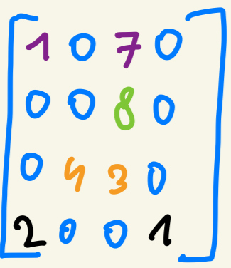
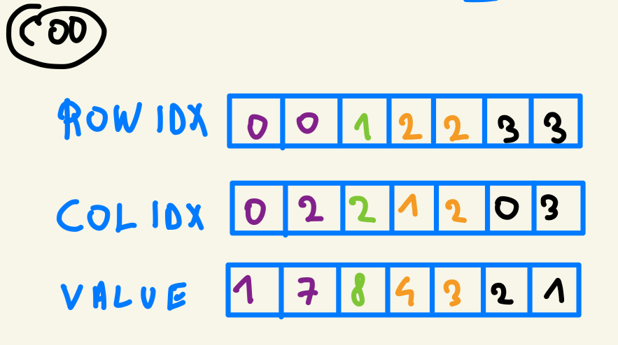
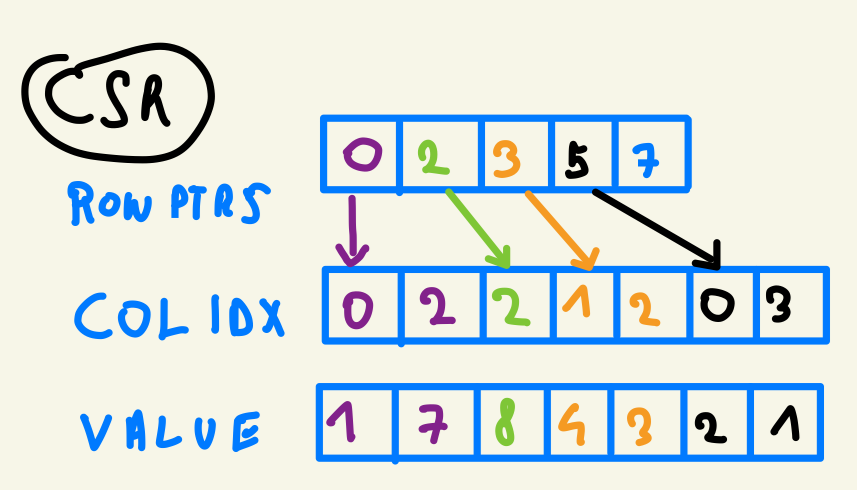
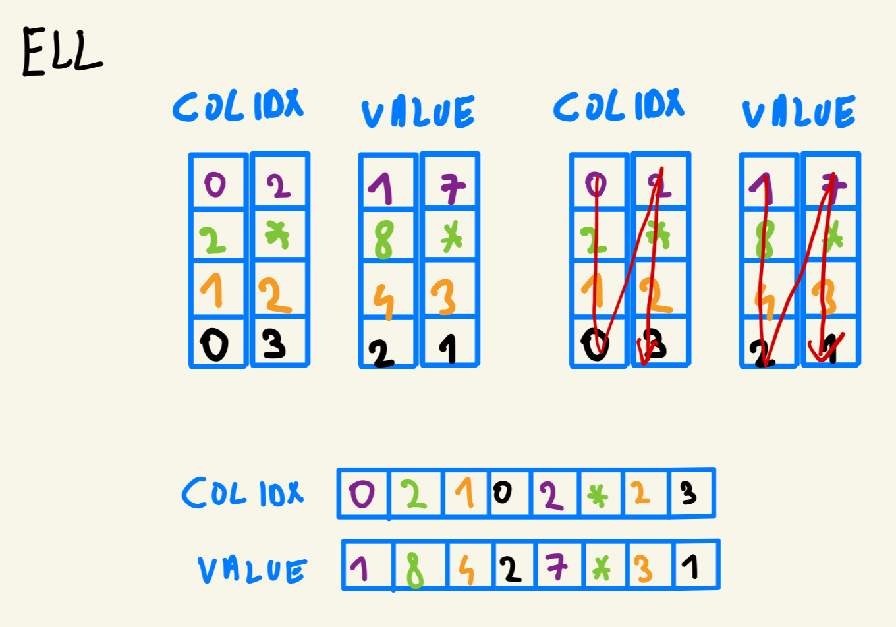
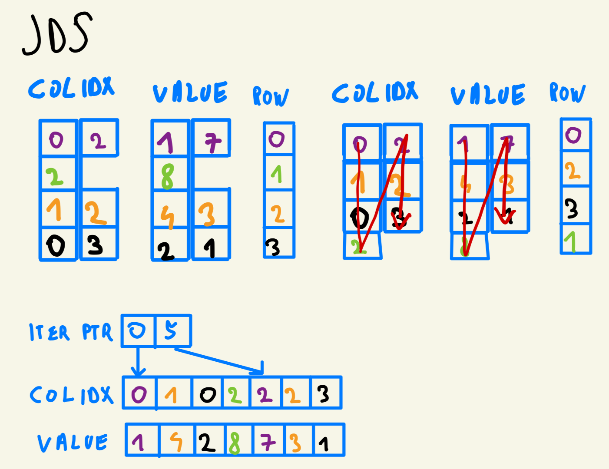

# 第十四章 稀疏矩阵计算

## 代码

我们实现了第十四章中提到的所有 SpMV（稀疏矩阵-向量乘法）方法，具体包括：

- [COO](code/coo.cu)（坐标格式）
- [CSR](code/csr.cu)（压缩稀疏行格式）
- [ELL](code/ell.cu)（ELLPACK 格式）
- [混合 ELL-COO](code/ell_coo_hybrid.cu)
- [JDS](code/jds.cu)（锯齿对角线存储格式）

使用我们提供的 Makefile 运行程序：

```bash
make
```

你应该看到类似以下的输出：

```bash
Compiling coo.cu -> coo...
✓ Successfully compiled coo
Compiling coo_to_csr.cu -> coo_to_csr...
✓ Successfully compiled coo_to_csr
Compiling csr.cu -> csr...
✓ Successfully compiled csr
Compiling ell_coo_hybrid.cu -> ell_coo_hybrid...
✓ Successfully compiled ell_coo_hybrid
Compiling ell.cu -> ell...
✓ Successfully compiled ell
Compiling jds.cu -> jds...
✓ Successfully compiled jds
=========================================
Build complete! Programs compiled:
  - coo
  - coo_to_csr
  - csr
  - ell_coo_hybrid
  - ell
  - jds
=========================================
Usage examples:
  ./coo            - Run COO SpMV
  ./csr            - Run CSR SpMV
  ./ell            - Run ELL SpMV
  ./jds            - Run JDS SpMV
  ./coo_to_csr     - Run COO to CSR conversion
  ./ell_coo_hybrid - Run Hybrid ELL-COO SpMV
=========================================
```

现在你可以运行任何你感兴趣的程序。

## 习题

### 习题 1

**考虑以下稀疏矩阵：**

```
1 0 7 0
0 0 8 0
0 4 3 0
2 0 0 1
```

**分别用以下格式表示它：(1) COO, (2) CSR, (3) ELL, (4) JDS。**



**COO（坐标格式）**

COO 格式存储三个数组：行索引 `rowIdx`、列索引 `colIdx` 和值 `values`，每个非零元素对应一个条目。



**CSR（压缩稀疏行格式）**

CSR 格式用 `rowPtrs` 数组（长度为行数+1）记录每行非零元素在 `colIdx` 和 `values` 数组中的起始位置。



**ELL（ELLPACK 格式）**

ELL 格式将每行填充到相同长度（等于最长行的非零元素数），使用列优先存储。填充位置用 -1 标记。



**JDS（锯齿对角线存储格式）**

JDS 格式先按每行非零元素数量降序排列行，然后按"迭代"（iteration/tile）组织数据，`iterPtr` 记录每次迭代的起始位置，`rowPerm` 记录行的排列顺序。



### 习题 2

**给定一个有 m 行、n 列、z 个非零元素的稀疏整数矩阵，分别用 (1) COO, (2) CSR, (3) ELL, (4) JDS 格式表示需要多少个整数？如果信息不足以回答，指出缺少什么信息。**

**COO**
需要 `z` 个整数存储 `rowIdx` 数组，`z` 个整数存储 `colIdx` 数组，`z` 个整数存储值。总共需要 `3z` 个整数。

**CSR**
需要 `z` 个整数存储 `colIdx` 数组，`z` 个整数存储 `value` 数组，`m+1` 个指针存储 `rowPtrs` 数组。总共需要 `2z + m + 1` 个整数。

**ELL**
信息不足以完全估算。在 ELL 格式中，我们需要将所有行填充到与最长行相同的长度。这里缺少最长行有多少个非零元素的信息。

假设所有行长度相同（无填充），需要 `z` 个整数存储 `colIdx` 数组和 `z` 个整数存储值数组，共 `2z` 个整数。实际上需要 `2z + 填充量` 个整数。

**JDS**
同样缺少关键信息，即非零元素最多的行有多少个非零元素。我们需要这个信息来确定 `iterPtr` 数组的大小。

假设每行非零元素数量相同，每行有 `z/m` 个非零元素。需要 `z/m + 1` 个整数存储 `iterPtr`，`z` 个整数存储 `colIdx`，`z` 个整数存储 `value`。总共 `2z + z/m + 1` 个整数。

### 习题 3

**使用基本的并行计算原语（包括直方图和前缀和）实现从 COO 到 CSR 的转换代码。**

转换代码实现在 [coo_to_csr.cu](code/coo_to_csr.cu) 中。

核心思路：
1. `computeHistogram` 内核：对每个非零元素，用 `atomicAdd` 将 `rowPtrs[rowIdx[i] + 1]` 加 1，统计每行的非零元素数量
2. `exclusiveScan` 内核：对 `rowPtrs` 数组执行前缀和，得到每行在 `colIdx`/`values` 数组中的起始偏移
3. `colIdx` 和 `values` 数组直接从 COO 格式复制（因为 COO 已按行排序）

```cpp
void cooToCsr(int nnz, int numRows, int *h_rowIdx, int *h_colIdx, float *h_values,
                int **d_csrRowPtrs, int **d_csrColIdx, float **d_csrValues) {
    // ... 分配内存和拷贝数据 ...
    computeHistogram<<<gridSize, blockSize>>>(nnz, d_rowIdx, *d_csrRowPtrs);
    exclusiveScan<<<1, numRows + 1>>>(*d_csrRowPtrs, numRows);
    // ... 拷贝 colIdx 和 values ...
}
```

### 习题 4

**实现混合 ELL-COO 格式的 host 端代码，并用它执行 SpMV。在设备上启动 ELL 内核，在 host 上计算 COO 元素的贡献。**

实现见 [ell_coo_hybrid.cu](code/ell_coo_hybrid.cu)。

核心思路：
- 将稀疏矩阵拆分为 ELL 部分和 COO 部分：每行前 `maxEllNonZeros` 个非零元素放入 ELL，超出部分放入 COO
- ELL 部分在 GPU 上用内核计算 SpMV
- COO 部分在 CPU 上顺序计算 SpMV
- 两部分结果相加得到最终结果

### 习题 5

**实现一个使用 JDS 格式存储的矩阵执行并行 SpMV 的内核。**

实现见 [jds.cu](code/jds.cu)。

核心思路：
- 每个线程负责一行的计算
- 遍历所有 tile（迭代层），对于每个 tile，检查当前线程是否有对应的非零元素
- 通过 `iterPtr[t] + tid` 索引到 `colIdx` 和 `values` 数组
- 如果索引在 `iterPtr[t+1]` 范围内，累加 `values[i] * x[colIdx[i]]`
- 最终结果写入 `y[rowPerm[tid]]`，通过 `rowPerm` 恢复原始行顺序

```cpp
__global__ void spmv_jds_kernel(JDSMatrix jdsMatrix, float* x, float* y) {
    unsigned int tid = blockIdx.x * blockDim.x + threadIdx.x;
    if (tid >= jdsMatrix.numRows) return;

    float sum = 0.0f;
    for (int t = 0; t < jdsMatrix.numTiles; ++t) {
        int i = jdsMatrix.iterPtr[t] + tid;
        if (i < jdsMatrix.iterPtr[t + 1]) {
            int col = jdsMatrix.colIdx[i];
            float value = jdsMatrix.values[i];
            sum += x[col] * value;
        }
    }
    y[jdsMatrix.rowPerm[tid]] = sum;
}
```
