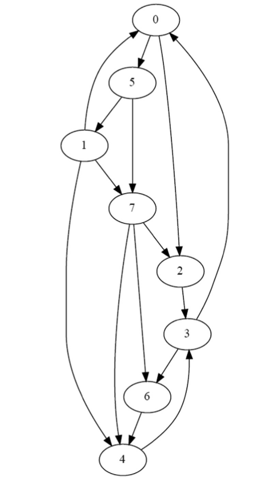
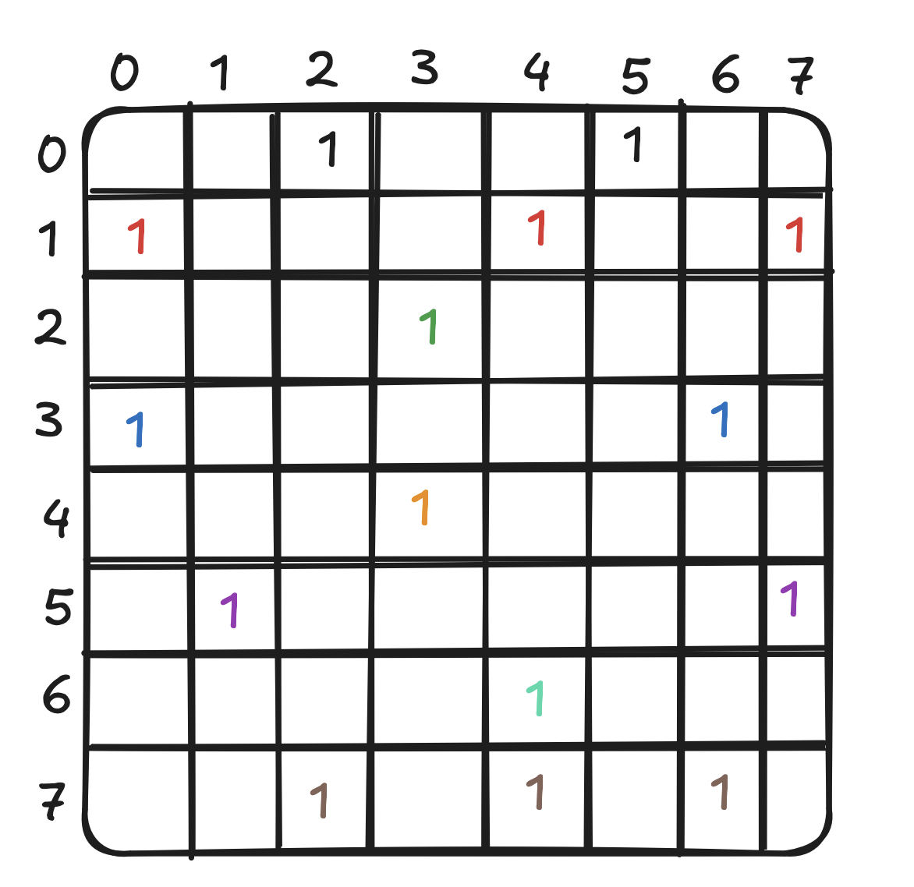
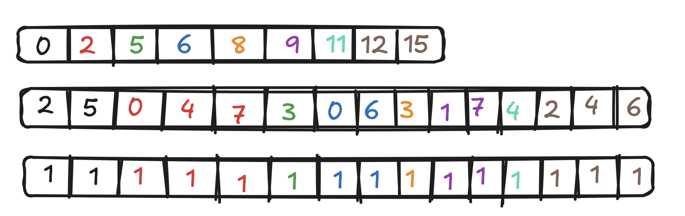

# 第十五章 图遍历 — 广度优先搜索（BFS）

## 代码

本章实现了（几乎）所有章节中提到的 BFS 方法，包括：

- Vertex-Centric Push（顶点中心推送）
- Vertex-Centric Pull（顶点中心拉取）
- Vertex-Centric 方向优化（先 push 后 pull）
- Edge-Centric（边中心）
- Frontier Vertex-Centric（前沿顶点中心，含/不含私有化）
- Frontier Vertex-Centric 单 block BFS 优化（Section 15.7）

所有实现见 [bfs_parallel.cu](./code/src/bfs_parallel.cu)。

我们还使用 [scale-free 和 small-world](./code/src/graph_generators.cu) 方法合成生成的图进行性能基准测试。

编译：

```bash
make
```

运行：

```bash
./bfs
```

## 图的存储格式

### CSR（Compressed Sparse Row，压缩稀疏行）

```c
struct CSRGraph {
    int* srcPtrs;    // 长度 numVertices+1，srcPtrs[v] 到 srcPtrs[v+1] 之间是顶点 v 的出边
    int* dst;        // 目标顶点数组
    int* values;     // 边权值
    int numVertices;
};
```

适用于 push 类型的 BFS：每个线程处理一个源顶点，遍历其出边。

### CSC（Compressed Sparse Column，压缩稀疏列）

```c
struct CSCGraph {
    int* dstPtrs;    // 长度 numVertices+1，dstPtrs[v] 到 dstPtrs[v+1] 之间是指向顶点 v 的入边
    int* src;        // 源顶点数组
    int* values;     // 边权值
    int numVertices;
};
```

适用于 pull 类型的 BFS：每个线程处理一个目标顶点，检查其入边邻居是否已被访问。

### COO（Coordinate，坐标格式）

```c
struct COOGraph {
    int* scr;        // 源顶点数组
    int* dst;        // 目标顶点数组
    int* values;     // 边权值
    int numEdges;
    int numVertices;
};
```

适用于 edge-centric BFS：每个线程处理一条边。

## BFS 算法变体

### 1. Vertex-Centric Push

每个线程对应一个顶点。如果该顶点在当前层级（`currLevel - 1`），则遍历其所有出边邻居，将未访问的邻居标记为 `currLevel`。

```cuda
if (levels[vertex] == currLevel - 1) {
    for (edge in vertex's neighbors) {
        if (levels[neighbor] == -1) {
            levels[neighbor] = currLevel;
            newVertexVisited = 1;
        }
    }
}
```

特点：
- 每次迭代启动 `numVertices` 个线程
- 只有当前层级的顶点做有效工作
- 适合 BFS 早期（前沿较小时）

### 2. Vertex-Centric Pull

每个线程对应一个顶点。如果该顶点尚未被访问（`levels[vertex] == -1`），则检查其入边邻居是否有在上一层级的，如果有则标记自己。

```cuda
if (levels[vertex] == -1) {
    for (edge in vertex's in-neighbors) {
        if (levels[neighbor] == currLevel - 1) {
            levels[vertex] = currLevel;
            newVertexVisited = 1;
            break;  // 找到一个即可
        }
    }
}
```

特点：
- 每次迭代启动 `numVertices` 个线程
- 未访问的顶点做有效工作
- 适合 BFS 后期（前沿较大、未访问顶点较少时）
- 使用 CSC 格式

### 3. Edge-Centric

每个线程对应一条边。检查源顶点是否在当前层级，如果是则尝试标记目标顶点。

```cuda
if (levels[src] == currLevel - 1) {
    if (levels[dst] == -1) {
        levels[dst] = currLevel;
        newVertexVisited = 1;
    }
}
```

特点：
- 每次迭代启动 `numEdges` 个线程
- 使用 COO 格式
- 线程间负载更均衡（每线程处理一条边而非一个顶点的所有边）

### 4. Frontier-based Vertex-Centric

只对前沿（frontier）中的顶点启动线程，而非所有顶点。使用 `atomicCAS` 避免重复添加邻居到下一层前沿。

```cuda
if (i < numPrevFrontier) {
    vertex = prevFrontier[i];
    for (edge in vertex's neighbors) {
        if (atomicCAS(&levels[neighbor], -1, currLevel) == -1) {
            idx = atomicAdd(numCurrentFrontier, 1);
            currFrontier[idx] = neighbor;
        }
    }
}
```

特点：
- 线程数 = 前沿大小（而非总顶点数）
- 使用 `atomicCAS` 保证正确性
- 使用 `atomicAdd` 管理前沿队列

### 5. Frontier-based with Privatization（私有化优化）

在共享内存（shared memory）中维护一个局部前沿，减少对全局内存的原子操作。当局部前沿溢出时，直接写入全局前沿。最后批量提交局部前沿到全局前沿。

```cuda
__shared__ unsigned int currFrontier_s[LOCAL_FRONTIER_CAPACITY];
__shared__ unsigned int numCurrFrontier_s;

// BFS 处理...
// 先写入 shared memory
idx_s = atomicAdd(&numCurrFrontier_s, 1);
if (idx_s < LOCAL_FRONTIER_CAPACITY) {
    currFrontier_s[idx_s] = neighbor;
} else {
    // 溢出，直接写全局
    globalIdx = atomicAdd(numCurrFrontier, 1);
    currFrontier[globalIdx] = neighbor;
}

__syncthreads();

// 批量提交到全局
startIdx = atomicAdd(numCurrFrontier, numCurrFrontier_s);
for (i = threadIdx.x; i < numCurrFrontier_s; i += blockDim.x) {
    currFrontier[startIdx + i] = currFrontier_s[i];
}
```

特点：
- 减少全局原子操作的竞争
- 使用 `LOCAL_FRONTIER_CAPACITY` 控制共享内存大小
- 两阶段提交：先本地，再全局

### 6. 方向优化（Direction-Optimized）

根据已访问顶点的比例动态切换 push 和 pull 策略：
- 当已访问比例 < α 时，使用 push（前沿小，push 效率高）
- 当已访问比例 ≥ α 时，切换到 pull（前沿大，pull 避免冗余遍历）

### 7. 单 Block 多层 BFS（Section 15.7）

当前沿足够小时，在单个 block 内完成多层 BFS，避免多次内核启动的开销。使用共享内存维护前沿，当溢出时回退到多 block 内核。

## 习题

### 习题 1

**考虑以下有向无权图：**



**a. 用邻接矩阵表示该图。**



**b. 用 CSR 格式表示该图。每个顶点的邻居列表必须排序。**



**从顶点 0 开始执行并行 BFS（即顶点 0 在第 0 层）。对于 BFS 遍历的每次迭代：**

**i. 如果使用 vertex-centric push 实现：**

#### 迭代 1

**启动多少个线程？**

有 8 个顶点，因此启动 8 个线程。

**多少个线程遍历其顶点的邻居？**

只有顶点 0 会遍历其邻居，所以只有 1 个线程。

#### 迭代 2

**启动多少个线程？**

有 8 个顶点，因此启动 8 个线程。

**多少个线程遍历其顶点的邻居？**

两个线程，顶点 `5` 和顶点 `2` 会遍历其邻居。

#### 迭代 3

**启动多少个线程？**

同上，8 个顶点 - 8 个线程。

**多少个线程遍历其顶点的邻居？**

现在有三个顶点在第 2 层：`1`、`7` 和 `3`，所以三个线程会遍历其邻居。

#### 迭代 4

**启动多少个线程？**

同样，8 个顶点 - 8 个线程。

**多少个线程遍历其顶点的邻居？**

有两个顶点在第 3 层：`4` 和 `6`，所以两个线程会遍历。

这也是最后一次迭代，所有顶点都已被访问，不会有新顶点被添加，没有线程会将 `newVertexVisited` 标志设为 1。

**ii. 如果使用 vertex-centric pull 实现：**

#### 迭代 1

**启动多少个线程？**

有 8 个顶点，启动 8 个线程。

**多少个线程遍历其顶点的邻居？**

7 个线程 - 除了顶点 `0` 的线程外，所有线程都会遍历其邻居。

**多少个线程标记其顶点？**

两个线程，顶点 `5` 和顶点 `2` 会标记其顶点。

#### 迭代 2

**启动多少个线程？**

有 8 个顶点，启动 8 个线程。

**多少个线程遍历其顶点的邻居？**

5 个线程，顶点 `1`、`7`、`6`、`3`、`4` 会遍历其邻居。

**多少个线程标记其顶点？**

3 个线程，顶点 `1`、`7` 和 `3` 会标记其顶点。

#### 迭代 3

**启动多少个线程？**

同样 - 8 个顶点，启动 8 个线程。

**多少个线程遍历其顶点的邻居？**

2 个线程，顶点 `6` 和顶点 `4` 会遍历其邻居。

**多少个线程标记其顶点？**

两个线程会标记其顶点。

#### 迭代 4

**启动多少个线程？**

同样 - 8 个顶点，启动 8 个线程。

**多少个线程遍历其顶点的邻居？**

没有，此时已没有未访问的顶点。

**多少个线程标记其顶点？**

同上 - 没有。这也是最后一次迭代，没有线程会将 `newVertexVisited` 标志设为 1。

**iii. 如果使用 edge-centric 实现：**

#### 迭代 1

**启动多少个线程？**

有 15 条边，所以启动 15 个线程。

**多少个线程可能标记一个顶点？**

两个线程，边 `0 -> 5` 和边 `0 -> 2`，会标记其顶点。

#### 迭代 2

**启动多少个线程？**

同样，15 条边，启动 15 个线程。

**多少个线程可能标记一个顶点？**

三个线程，边 `5 -> 1`、`5 -> 7` 和 `2 -> 3`。

#### 迭代 3

**启动多少个线程？**

同样，15 条边，启动 15 个线程。

**多少个线程可能标记一个顶点？**

四个线程，边 `3 -> 6`、`7 -> 6`、`1 -> 4`、`7 -> 4`，注意其中两个操作是***幂等的***，因为它们并不会真正改变已分配给顶点的标签。

#### 迭代 4

**启动多少个线程？**

同样，15 条边，启动 15 个线程。

**多少个线程可能标记一个顶点？**

0 个，第 3 层有 2 个顶点，但其所有邻居都已被访问，因此没有线程会标记顶点。这也是最后一次迭代，没有线程会修改 `newVertexVisited` 标志。

**iv. 如果使用 vertex-centric push frontier-based 实现：**

假设迭代 1 以 `[0]` 在 `prevFrontier` 中开始。

#### 迭代 1

**启动多少个线程？**

只启动 1 个线程处理顶点 0。

**多少个线程遍历其顶点的邻居？**

只有一个线程遍历其顶点邻居。将 `[5, 2]` 添加到 `currFrontier`。

#### 迭代 2

**启动多少个线程？**

`prevFrontier` 中有两个元素，所以启动两个线程。

**多少个线程遍历其顶点的邻居？**

两个线程，顶点 `5` 和 `2` 遍历其顶点邻居。将 `[1, 7, 3]` 添加到 `currFrontier`。

#### 迭代 3

**启动多少个线程？**

`prevFrontier` 中有三个元素，所以启动三个线程。

**多少个线程遍历其顶点的邻居？**

三个线程，顶点 `1`、`7` 和 `3` 遍历其顶点邻居。将 `[4, 6]` 添加到 `currFrontier`，注意取决于哪个线程先访问，`6` 会由顶点 `3` 或顶点 `7` 的线程添加。

#### 迭代 4

**启动多少个线程？**

`prevFrontier` 中有两个元素 `[4, 6]`，所以启动两个线程。

**多少个线程遍历其顶点的邻居？**

两个线程都会遍历，但没有未访问的顶点，因此不会有顶点被添加到 `currFrontier`，这将通知函数不需要再启动 grid。

### 习题 2

**实现 Section 15.3 中描述的方向优化 BFS 的 host 代码。**

完整实现见 [bfs_parallel.cu](./code/src/bfs_parallel.cu)：

```cpp
int* bfsDirectionOptimizedDevice(const CSRGraph& deviceCSRGraph, const CSCGraph& deviceCSCGraph, 
                                  int startingNode, float alpha) {
    // 初始化 host 端 levels 数组
    int* hostLevels = (int*)malloc(sizeof(int) * deviceCSRGraph.numVertices);
    for (int i = 0; i < deviceCSRGraph.numVertices; i++) {
        hostLevels[i] = -1;
    }
    hostLevels[startingNode] = 0;

    size_t vertexSize = sizeof(int) * deviceCSRGraph.numVertices;

    // 分配 device 内存
    int *d_levels, *d_newVertexVisited;
    cudaMalloc(&d_levels, vertexSize);
    cudaMalloc(&d_newVertexVisited, sizeof(int));
    cudaMemcpy(d_levels, hostLevels, vertexSize, cudaMemcpyHostToDevice);

    int threadsPerBlock = 256;
    int blocksPerGrid = (deviceCSRGraph.numVertices + threadsPerBlock - 1) / threadsPerBlock;

    int currLevel = 1;
    int hostNewVertexVisited = 1;
    int totalVertices = deviceCSRGraph.numVertices;
    int visitedVertices = 1;
    bool usingPush = true;

    while (hostNewVertexVisited != 0) {
        hostNewVertexVisited = 0;
        cudaMemcpy(d_newVertexVisited, &hostNewVertexVisited, sizeof(int), cudaMemcpyHostToDevice);

        // 根据已访问比例决定使用 push 还是 pull
        float visitedFraction = (float)visitedVertices / totalVertices;
        if (usingPush && visitedFraction > alpha) {
            usingPush = false;
        }

        if (usingPush) {
            bsf_push_vertex_centric_kernel<<<blocksPerGrid, threadsPerBlock>>>(
                deviceCSRGraph, d_levels, d_newVertexVisited, currLevel);
        } else {
            bsf_pull_vertex_centric_kernel<<<blocksPerGrid, threadsPerBlock>>>(
                deviceCSCGraph, d_levels, d_newVertexVisited, currLevel);
        }

        cudaDeviceSynchronize();
        cudaMemcpy(&hostNewVertexVisited, d_newVertexVisited, sizeof(int), cudaMemcpyDeviceToHost);

        if (hostNewVertexVisited) {
            cudaMemcpy(hostLevels, d_levels, vertexSize, cudaMemcpyDeviceToHost);
            int newVisitedCount = 0;
            for (int i = 0; i < totalVertices; i++) {
                if (hostLevels[i] != -1) newVisitedCount++;
            }
            visitedVertices = newVisitedCount;
        }
        currLevel++;
    }

    cudaMemcpy(hostLevels, d_levels, vertexSize, cudaMemcpyDeviceToHost);
    cudaFree(d_levels);
    cudaFree(d_newVertexVisited);
    return hostLevels;
}
```

### 习题 3

**实现 Section 15.7 中描述的单 block BFS 内核。**

完整实现见 [bfs_parallel.cu](./code/src/bfs_parallel.cu)：

```cpp
__global__ void bfs_multi_level_frontier_kernel(CSRGraph graph, int* levels, 
                                         int* frontier, int* frontierSize,
                                         int* nextFrontier, int* nextFrontierSize,
                                         int currLevel) {
    __shared__ int localFrontier[LOCAL_FRONTIER_CAPACITY];
    __shared__ int localFrontierSize;
    __shared__ int nextLocalFrontierSize;
    __shared__ bool overflowed;

    if (threadIdx.x == 0) {
        localFrontierSize = *frontierSize;
        nextLocalFrontierSize = 0;
        overflowed = false;
        for (int i = 0; i < localFrontierSize && i < LOCAL_FRONTIER_CAPACITY; i++) {
            localFrontier[i] = frontier[i];
        }
    }
    __syncthreads();

    for (int i = threadIdx.x; i < localFrontierSize; i += blockDim.x) {
        int vertex = localFrontier[i];
        for (unsigned int edge = graph.srcPtrs[vertex]; 
             edge < graph.srcPtrs[vertex + 1]; edge++) {
            unsigned int neighbor = graph.dst[edge];
            if (atomicCAS(&levels[neighbor], -1, currLevel) == -1) {
                int idx = atomicAdd(&nextLocalFrontierSize, 1);
                if (idx < LOCAL_FRONTIER_CAPACITY) {
                    localFrontier[idx] = neighbor;
                } else {
                    overflowed = true;
                    int globalIdx = atomicAdd(nextFrontierSize, 1);
                    nextFrontier[globalIdx] = neighbor;
                }
            }
        }
    }
    __syncthreads();

    if (threadIdx.x == 0) {
        if (overflowed) {
            for (int i = 0; i < nextLocalFrontierSize && i < LOCAL_FRONTIER_CAPACITY; i++) {
                int globalIdx = atomicAdd(nextFrontierSize, 1);
                nextFrontier[globalIdx] = localFrontier[i];
            }
            *frontierSize = 0;  // 信号：需要切换到多 block
        } else {
            *frontierSize = nextLocalFrontierSize;
            for (int i = 0; i < nextLocalFrontierSize; i++) {
                frontier[i] = localFrontier[i];
            }
        }
    }
}
```
