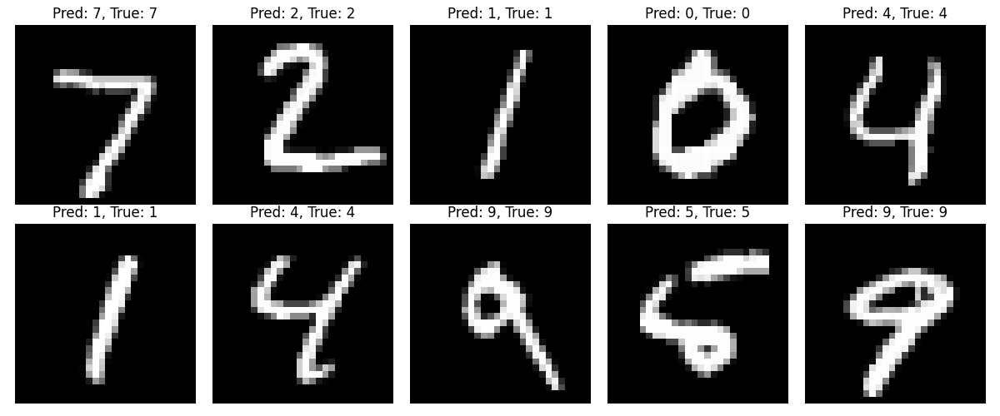

# 第十六章

## 代码

为了学习目的，我们实现了本章描述的几种技术。具体来说，我们实现了反向传播和池化的顺序实现，更重要的是，我们实现了一个最小版本的自动微分（autograd）系统。

### Autograd - 手动实现

本章中我们实现的最有趣的组件，毫无疑问是自动微分引擎的手动实现。

按照 `Training models`（训练模型）和 `Convolutional neural network backpropagation`（卷积神经网络反向传播）子章节，我们实现了 `Linear`（全连接层）、`Conv2D`（二维卷积层）和 `MaxPooling2D`（最大池化层）的前向传播和反向传播。所有层都实现了以下接口：

```py
class Layer:
    def forward(self, x):
        raise NotImplementedError

    def backward(self, grad_output):
        raise NotImplementedError

    def parameters(self):
        return []

    def __call__(self, x):
        return self.forward(x)
```

对于每一层，我们实现了一个反向传播函数，给定输出梯度后：
- 计算所有参数的梯度
- 计算输入的梯度并返回，以便前一层可以使用

对于前向和反向传播，我们封装了 CUDA 代码：全连接层使用 cuBLAS 矩阵乘法，`Conv2D` 和 `MaxPooling2D` 层使用自定义的 Conv2d 前向传播。

我们实现了两个简单的训练示例：

- [xor](./code/autograd_manual/examples/xor_example.py)：在 XOR 问题上训练一个简单的两层神经网络
- [mnist](./code/autograd_manual/examples/mnist_example.py)：在 MNIST 上训练一个简单的 CNN，3 个 epoch 达到约 98% 的准确率

你可以通过运行 `main.py` 并加上 `--xor` 或 `--mnist` 标志来运行这些示例。我们没有使用任何 PyTorch 训练代码，以展示 Autograd 在底层是如何工作的。实现一个反向传播并训练出不错的图像分类模型所需的代码量之少，确实令人惊叹。

要运行代码，你需要先编译我们的前向和反向传播。运行 [Makefile](./code/autograd_manual/Makefile) 即可：

```bash
cd code/autograd_manual

make
```

#### XOR

```bash
python main.py --xor

Successfully loaded cuBLAS wrapper library
cuBLAS initialized successfully
Successfully loaded conv2dcuda wrapper library
Using CUDA kernel implementation (no cuDNN)
Running XOR example with CUDA acceleration...
Starting training...
Epoch [100/1000], Loss: 0.000844
Epoch [200/1000], Loss: 0.000272
Epoch [300/1000], Loss: 0.000154
Epoch [400/1000], Loss: 0.000110
Epoch [500/1000], Loss: 0.000078
Epoch [600/1000], Loss: 0.000075
Epoch [700/1000], Loss: 0.000046
Epoch [800/1000], Loss: 0.000043
Epoch [900/1000], Loss: 0.000035
Epoch [1000/1000], Loss: 0.000033

Final predictions:
Input => Output (Expected)
[0.0, 0.0] => 0.0047 (0.0)
[0.0, 1.0] => 0.9951 (1.0)
[1.0, 0.0] => 0.9951 (1.0)
[1.0, 1.0] => 0.0026 (0.0)

Training complete!
Final loss: 3.339664181112312e-05
XOR example completed successfully
cuBLAS cleaned up successfully
Cleaning up CUDA kernel implementation (no cuDNN)
Cleaned up cuBLAS and cuDNN resources
```

#### MNIST

```bash
python main.py --mnist

Successfully loaded cuBLAS wrapper library
cuBLAS initialized successfully
Successfully loaded conv2dcuda wrapper library
Using CUDA kernel implementation (no cuDNN)
Running MNIST CNN example with CUDA acceleration...
Loading MNIST data using torchvision...
Loaded 60000 training samples and 10000 test samples
Starting training...
Epoch [1/3], Step [187/938], Loss: 0.5718, Accuracy: 83.53%
Epoch [1/3], Step [374/938], Loss: 0.3654, Accuracy: 89.40%
Epoch [1/3], Step [561/938], Loss: 0.2840, Accuracy: 91.70%
Epoch [1/3], Step [748/938], Loss: 0.2352, Accuracy: 93.08%
Epoch [1/3], Step [935/938], Loss: 0.2039, Accuracy: 93.97%
Epoch [1/3] completed, Loss: 0.2034, Accuracy: 93.98%
Epoch [2/3], Step [187/938], Loss: 0.0632, Accuracy: 98.02%
Epoch [2/3], Step [374/938], Loss: 0.0628, Accuracy: 98.03%
Epoch [2/3], Step [561/938], Loss: 0.0580, Accuracy: 98.16%
Epoch [2/3], Step [748/938], Loss: 0.0568, Accuracy: 98.24%
Epoch [2/3], Step [935/938], Loss: 0.0569, Accuracy: 98.24%
Epoch [2/3] completed, Loss: 0.0569, Accuracy: 98.24%
Epoch [3/3], Step [187/938], Loss: 0.0419, Accuracy: 98.65%
Epoch [3/3], Step [374/938], Loss: 0.0401, Accuracy: 98.68%
Epoch [3/3], Step [561/938], Loss: 0.0387, Accuracy: 98.74%
Epoch [3/3], Step [748/938], Loss: 0.0383, Accuracy: 98.74%
Epoch [3/3], Step [935/938], Loss: 0.0383, Accuracy: 98.76%
Epoch [3/3] completed, Loss: 0.0382, Accuracy: 98.76%

Testing the model...
Test Accuracy: 98.74%

Showing some example predictions...
MNIST CNN example completed successfully
cuBLAS cleaned up successfully
Cleaning up CUDA kernel implementation (no cuDNN)
Cleaned up cuBLAS and cuDNN resources
```



### Autograd（利用 torch）

我们还利用 `torch` 的 autograd 实现了一个最小版本。我们展示了一个类需要实现的最小接口，以便能够与 torch autograd 一起使用。

```py
class LinearFunction(Function):
    @staticmethod
    def forward(ctx, input, weight, bias=None):
        ctx.save_for_backward(input, weight, bias)
        output = input.matmul(weight.t())
        if bias is not None:
            output += bias.unsqueeze(0).expand_as(output)
        return output

    @staticmethod
    def backward(ctx, grad_output):
        input, weight, bias = ctx.saved_tensors
        grad_input = grad_weight = grad_bias = None
        
        if ctx.needs_input_grad[0]:
            # dL/dx = dL/doutput * d(output)/dx = dL/doutput * W 
            grad_input = grad_output.matmul(weight)
            
        if ctx.needs_input_grad[1]:
            # dL/dW = dL/doutput * d(output)/dW = X^T * dL/doutput
            grad_weight = grad_output.t().matmul(input)
            
        if bias is not None and ctx.needs_input_grad[2]:
            # dL/db = sum(dL/doutput)
            # Sum over batch dimension since bias is added to each sample
            grad_bias = grad_output.sum(0)
            
        return grad_input, grad_weight, grad_bias
```

我们实现上述代码是为了更好地理解 Torch 在底层是如何工作的（backward 方法至关重要）。

### 池化（Pooling）

对于练习 1，我们实现了顺序池化层：

```bash
cd code/pooling

python setup.py build_ext --inplace

python main.py
```

```bash
=== Testing Pooling Implementation ===
Testing Max Pooling...
Max Pooling - Maximum Difference: 0.0

Testing Average Pooling...
Average Pooling - Maximum Difference: 0.0

✓ Tests passed!

=== Performance Benchmarks ===

Input size: [2, 16, 32, 32]
Max Pooling - Custom: 0.058ms, PyTorch: 0.002ms
Avg Pooling - Custom: 0.002ms, PyTorch: 0.001ms

Input size: [8, 64, 128, 128]
Max Pooling - Custom: 82.433ms, PyTorch: 9.454ms
Avg Pooling - Custom: 47.322ms, PyTorch: 3.836ms
```

### Conv2D 反向传播

对于练习 4，我们实现了顺序 conv2d 反向传播，并与 torch 实现进行了性能验证。

```bash
cd code/conv2d_backward

python main.py
```

输出应该类似于：

```bash
PyTorch gradient shape: (3, 28, 28)
Our gradient shape: (3, 28, 28)
Maximum absolute difference: 2.86102294921875e-06
Average absolute difference: 3.000727701873984e-07
Results match: True

=== Running multiple tests with different configurations ===

Testing with M=2, C=3, H_in=5, W_in=5, K=3
Results match: True, Max difference: 9.5367431640625e-07

Testing with M=4, C=3, H_in=10, W_in=10, K=3
Results match: True, Max difference: 2.86102294921875e-06

Testing with M=2, C=1, H_in=7, W_in=5, K=3
Results match: True, Max difference: 9.5367431640625e-07

Testing with M=3, C=2, H_in=8, W_in=8, K=5
Results match: True, Max difference: 2.86102294921875e-06

Testing with M=1, C=3, H_in=6, W_in=6, K=2
Results match: True, Max difference: 4.76837158203125e-07
```

## 习题

### 练习 1

**实现第 16.2 节中描述的池化层前向传播。**

我们在 [pooling.c](./code/pooling/pooling.c) 中实现了这个函数。参见 [池化](#池化pooling)

```cpp
void poolingLayer_forward(int M, int H, int W, int K, float* Y, float* S, const char* pooling_type) {
    for(int m = 0; m < M; m++)              // 对每个输出特征图
        for(int h = 0; h < H/K; h++)        // 对每个输出元素，
            for(int w = 0; w < W/K; w++) {  // 此代码假设 H 和 W
                // 根据池化类型初始化
                if(strcmp(pooling_type, "max") == 0)
                    S[m*(H/K)*(W/K) + h*(W/K) + w] = -FLT_MAX;  // 最大池化
                else
                    S[m*(H/K)*(W/K) + h*(W/K) + w] = 0.0f;      // 平均池化
                
                // 遍历 KxK 输入窗口
                for(int p = 0; p < K; p++) {
                    for(int q = 0; q < K; q++) {
                        float val = Y[m*H*W + (K*h + p)*W + (K*w + q)];
                        
                        if(strcmp(pooling_type, "max") == 0) {
                            // 最大池化
                            if(val > S[m*(H/K)*(W/K) + h*(W/K) + w])
                                S[m*(H/K)*(W/K) + h*(W/K) + w] = val;
                        }
                        else {
                            // 平均池化
                            S[m*(H/K)*(W/K) + h*(W/K) + w] += val / (K*K);
                        }
                    }
                }
            }
}
```

### 练习 2

**我们使用了 [N x C x H x W] 布局来存储输入和输出特征。改为 [N x H x W x C] 布局能否减少内存带宽？使用 [C x H x W x N] 布局有什么潜在好处？**

对于 [N x H x W x C] 布局：
- 当卷积核在空间维度上滑动时，同一空间位置的不同通道在内存中是连续的
- 这对于 1x1 卷积特别有利，因为它只需要跨通道操作
- 但对于标准卷积，空间上相邻的元素不再连续，可能降低空间局部性

对于 [C x H x W x N] 布局：
- 同一通道、同一空间位置的不同 batch 样本在内存中连续
- 当 batch size 较大时，可以实现更好的内存合并访问（coalesced access）
- 多个样本的相同位置可以同时加载，提高 SIMD 利用率

### 练习 3

**实现第 16.2 节中描述的卷积层反向传播。**

实现在 [conv_ops.c](./code/conv2d_backward/conv_ops.c) 中。

```cpp
void convLayer_backward_x_grad(int M, int C, int H_in, int W_in, int K,
 float* dE_dY, float* W, float* dE_dX) {
    int H_out = H_in - K + 1;
    int W_out = W_in - K + 1;
    
    // 将 dE_dX 初始化为零
    for(int c = 0; c < C; c++)
        for(int h = 0; h < H_in; h++)
            for(int w = 0; w < W_in; w++)
                dE_dX[c * H_in * W_in + h * W_in + w] = 0;
    
    // 计算梯度
    for(int m = 0; m < M; m++)
        for(int h_out = 0; h_out < H_out; h_out++)
            for(int w_out = 0; w_out < W_out; w_out++)
                for(int c = 0; c < C; c++)
                    for(int p = 0; p < K; p++)
                        for(int q = 0; q < K; q++) {
                            int h_in = h_out + p;
                            int w_in = w_out + q;
                            dE_dX[c * H_in * W_in + h_in * W_in + w_in] += 
                                dE_dY[m * H_out * W_out + h_out * W_out + w_out] * 
                                W[m * C * K * K + c * K * K + p * K + q];
                        }
}
```

### 练习 4

**分析图 16.18 中 unroll_Kernel 对 X 的读取访问模式，说明相邻线程的内存读取是否可以合并（coalesced）。**

```cpp
__global__ void
unroll_Kernel(int C, int H, int W, int K, float* X, float* X_unroll) {
    int t = blockIdx.x * blockDim.x + threadIdx.x;
    int H_out = H - K + 1;
    int W_out = W - K + 1;
    int W_unroll = H_out * W_out;
    if (t < C * W_unroll) {
        int c = t / W_unroll;
        int w_unroll = t % W_unroll;
        int h_out = w_unroll / W_out;
        int w_out = w_unroll % W_out;
        int w_base = c * K * K;
        for(int p = 0; p < K; p++)
            for(int q = 0; q < K; q++) {
                int h_unroll = w_base + p*K + q;
                X_unroll[h_unroll, w_unroll] = X[c, h_out + p, w_out + q];
            }
    }
}
```

首先将内存读取操作线性化。对于 `X_unroll`，应用标准行优先顺序：

```
X_unroll[h_unroll][w_unroll] = X_unroll[(h_unroll * W_unroll) + w_unroll]
```

对于 `X`：

```cpp
X[c][h_out + p][w_out + q] = X[(c * H * W) + ((h_out + p) * W) + (w_out + q)]
```

在内核中，`t` 用于计算：

- `c = t / W_unroll`
- `w_unroll = t % W_unroll`
- `h_out = w_unroll / W_out`
- `w_out = w_unroll % W_out`

当 `t` 增加 1（即相邻线程）时，会发生以下情况：

#### 情况 1 - `c` 不变

此时：
- `w_unroll` 增加 1
- 如果 `w_out < W_out - 1`，则 `w_out` 增加 1，`h_out` 不变
- 如果 `w_out == W_out - 1`，则 `w_out` 回绕为 0，`h_out` 增加 1

**当 w_out 增加 1 时：**
内存地址变化为：

```cpp
t:   (c * H * W) + ((h_out + p) * W) + (w_out + q)
t+1: (c * H * W) + ((h_out + p) * W) + (w_out + q + 1)
```

差值恰好为 1，因此获得完美的合并内存访问。

**当 w_out 回绕且 h_out 增加时：**

```cpp
t:   (c * H * W) + ((h_out + p) * W) + (W_out - 1 + q)
t+1: (c * H * W) + ((h_out + p + 1) * W) + (0 + q)
```

差值为：

```cpp
((h_out + p + 1) * W) + q - ((h_out + p) * W) - (W_out - 1 + q)
= W - (W_out - 1) = W - W_out + 1 = W - (W - K + 1) + 1 = K
```

因为 `W_out = W - K + 1`

所以内存地址相差 `K` 个元素，这通常是一个较小的数（滤波器大小）。如果 `K` 较小（如 `3` 或 `5`），仍然可能获得一些合并访问的好处，但不是最理想的。

#### 情况 2 - `c` 变化 - 不同通道

`t+1` 的内存访问大约变化 `H x W`（整个通道），这通常很大，因此不会有合并访问。

#### 总结三种情况：

1. 同通道、同行（完美合并）：当相邻线程访问相同 `h_out` 但连续 `w_out` 值的元素时。对于 `224×224` 图像和 `3×3` 滤波器，`W_out = 222`，意味着每行有 222 个连续线程实现完美合并。

2. 同通道、行边界（部分合并）：当线程从一行末尾移到下一行开头时，步幅为 `K`。对于 `224×224` 图像，每个通道发生 223 次。

3. 通道边界（无合并）：每 `W_unroll` 个线程发生一次。对于 `224×224` 图像和 `3×3` 滤波器，`W_unroll = 222 × 222 ≈ 49,284`，发生频率极低（`1/49284`）。

绝大多数内存访问（>99%）在处理典型图像尺寸时都属于完美合并类别。
